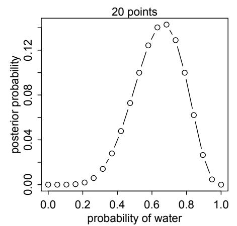

# 2 Mundos Pequenos e Mundos Grandes
Quando Cristoforo Colombo (Cristóvão Colombo) navegou infamemente para o oeste no ano de 1492, ele acreditava que a Terra era esférica. Nisso, ele era como a maioria das pessoas instruídas de sua época. Ele diferia da maioria, porém, ao acreditar que o planeta era muito menor do que realmente é — apenas 30.000 km ao redor de seu equador, em vez dos 40.000 km reais (Figura 2.1).$^{37}$ Esse foi um dos erros mais consequentes da história europeia. Se Colombo tivesse acreditado que a Terra tinha 40.000 km de circunferência, ele teria raciocinado corretamente que sua frota não poderia carregar comida e água potável suficientes para completar uma viagem inteiramente para o oeste até a Ásia. Mas com 30.000 km de circunferência, a Ásia estaria um pouco a oeste da costa da Califórnia. Era possível carregar suprimentos suficientes para chegar tão longe. Encorajado em parte por sua estimativa não convencional, Colombo zarpou, eventualmente aportando nas Bahamas.

Colombo fez uma predição baseada em sua visão de que o mundo era pequeno. Mas como ele vivia em um mundo grande, aspectos da predição estavam errados. No seu caso, o erro foi sortudo. Seu modelo de mundo pequeno estava errado de uma maneira inesperada: havia muita terra no caminho. Se ele tivesse errado da maneira esperada, com nada além de oceano entre a Europa e a Ásia, ele e toda a sua expedição teriam ficado sem suprimentos muito antes de alcançar as Índias Orientais.

Os mundos pequeno e grande de Colombo oferecem um contraste entre modelo e realidade. Toda modelagem estatística possui esses mesmos dois enquadramentos: o mundo pequeno do modelo em si e o mundo grande no qual esperamos aplicar o modelo.$^{38}$ Navegar entre esses dois mundos permanece um desafio central da modelagem estatística. O desafio é agravado quando se esquece a distinção.

O **mundo pequeno** é o mundo lógico autocontido do modelo. Dentro do mundo pequeno, todas as possibilidades são nomeadas. Não há surpresas puras, como a existência de um enorme continente entre a Europa e a Ásia. Dentro do mundo pequeno do modelo, é importante ser capaz de verificar a lógica do modelo, assegurando que ele funciona conforme esperado sob suposições favoráveis. Modelos bayesianos têm algumas vantagens nesse aspecto, pois possuem reivindicações razoáveis de otimalidade: nenhum modelo alternativo poderia fazer melhor uso da informação nos dados e apoiar melhores decisões, assumindo que o mundo pequeno é uma descrição precisa do mundo real.$^{39}$

O **mundo grande** é o contexto mais amplo no qual se aplica um modelo. No mundo grande, podem existir eventos que não foram imaginados no mundo pequeno. Além disso, o modelo é sempre uma representação incompleta do mundo grande, e portanto cometerá erros, mesmo que todos os tipos de eventos tenham sido devidamente nomeados. A consistência lógica de um modelo no mundo pequeno não é garantia de que ele será ótimo no mundo grande. Mas certamente é um conforto reconfortante.


Figura 2.1. Ilustração do globo de Martin Behaim de 1492, mostrando o mundo pequeno que Colombo antecipava. A Europa está no lado direito. A Ásia está à esquerda. A grande ilha rotulada "Cipangu" é o Japão.

Neste capítulo, você começará a construir modelos bayesianos. A maneira como modelos bayesianos aprendem a partir de evidências é indiscutivelmente ótima no mundo pequeno. Quando suas suposições se aproximam da realidade, eles também têm bom desempenho no mundo grande. Mas o desempenho no mundo grande precisa ser demonstrado, e não deduzido logicamente. Transitar entre esses dois mundos permite que tanto métodos formais, como a inferência bayesiana, quanto métodos informais, como a revisão por pares, desempenhem um papel indispensável.

Este capítulo foca no mundo pequeno. Ele explica a teoria da probabilidade em sua forma essencial: contando as maneiras como as coisas podem acontecer. A inferência bayesiana surge automaticamente dessa perspectiva. Em seguida, o capítulo apresenta os componentes estilizados de um modelo estatístico bayesiano, um modelo para aprender a partir de dados. Depois, mostra como animar o modelo para produzir estimativas.

Todo esse trabalho fornece uma base para o próximo capítulo, no qual você aprenderá a resumir estimativas bayesianas, bem como começará a considerar as obrigações do mundo grande.

> **Repensando: Rápido e frugal no mundo grande.** O mundo natural é complexo, como a tentativa de fazer ciência nos lembra. No entanto, tudo, desde o humilde carrapato até o industrioso esquilo e a preguiça ociosa, consegue frequentemente tomar decisões adaptativas. Mas é uma boa aposta que a maioria dos animais não é bayesiana, até porque ser bayesiano é caro e depende de ter um bom modelo. Em vez disso, os animais usam diversas heurísticas que são ajustadas aos seus ambientes, passados ou presentes. Essas heurísticas tomam atalhos adaptativos e, portanto, podem superar uma análise bayesiana rigorosa, uma vez que os custos de coleta e processamento de informação (e sobreajuste, Capítulo 6) são levados em conta.$^{40}$ Uma vez que você já sabe qual informação ignorar ou prestar atenção, ser completamente bayesiano é um desperdício. Não é necessário nem suficiente para tomar boas decisões, como animais reais demonstram. Mas para animais humanos, a análise bayesiana fornece uma maneira geral de descobrir informações relevantes e processá-las logicamente. Apenas não pense que é a única maneira.

## 2.1. O jardim dos dados bifurcantes
Nosso objetivo nesta seção será construir a inferência bayesiana a partir de origens humildes, para que não haja superstição a respeito dela. A inferência bayesiana é realmente apenas contagem e comparação de possibilidades. Considere, por analogia, o conto de Jorge Luis Borges, "O Jardim dos Caminhos que se Bifurcam." A história é sobre um homem que encontra um livro cheio de contradições. Na maioria dos livros, os personagens chegam a pontos da trama e devem decidir entre caminhos alternativos. Uma protagonista pode chegar à casa de um homem. Ela pode matar o homem, ou então tomar uma xícara de chá. Apenas

um desses caminhos é tomado — assassinato ou chá. Mas o livro dentro da história de Borges explora todos os caminhos, com cada decisão se ramificando para fora em um jardim cada vez mais amplo de caminhos bifurcantes.

Este é o mesmo dispositivo que a inferência bayesiana oferece. Para fazer boas inferências sobre o que realmente aconteceu, ajuda considerar tudo o que poderia ter acontecido. Uma análise bayesiana é um jardim de dados bifurcantes, no qual sequências alternativas de eventos são cultivadas. À medida que aprendemos sobre o que aconteceu, algumas dessas sequências alternativas são podadas. No final, o que resta é apenas o que é logicamente consistente com nosso conhecimento.

Essa abordagem fornece uma classificação quantitativa de hipóteses, uma classificação que é maximamente conservadora, dadas as suposições e os dados que a alimentam. A abordagem não pode garantir uma resposta correta em termos de mundo grande. Mas pode garantir a melhor resposta possível, em termos de mundo pequeno, que poderia ser derivada da informação fornecida.

Considere o seguinte exemplo didático.

**2.1.1. Contando possibilidades.** Suponha que haja um saco contendo quatro bolinhas de gude. Essas bolinhas vêm em duas cores: azul e branca. Sabemos que há quatro bolinhas no saco, mas não sabemos quantas são de cada cor. Sabemos que existem cinco possibilidades: (1) [⚪⚪⚪⚪], (2) [🔵⚪⚪⚪], (3) [🔵🔵⚪⚪], (4) [🔵🔵🔵⚪], (5) [🔵🔵🔵🔵]. Essas são as únicas possibilidades consistentes com o que sabemos sobre o conteúdo do saco. Chame essas cinco possibilidades de conjecturas.

Nosso objetivo é descobrir qual dessas conjecturas é mais plausível, dada alguma evidência sobre o conteúdo do saco. Temos alguma evidência: uma sequência de três bolinhas é retirada do saco, uma de cada vez, recolocando a bolinha cada vez e agitando o saco antes de retirar outra bolinha. A sequência que emerge é: 🔵⚪🔵, nessa ordem. Esses são os dados.

Então, vamos plantar o jardim e ver como usar os dados para inferir o que está no saco. Comecemos considerando apenas a conjectura [🔵⚪⚪⚪], de que o saco contém uma bolinha azul e três brancas. Na primeira retirada do saco, uma de quatro coisas poderia acontecer, correspondendo a uma das quatro bolinhas no saco. Assim, podemos visualizar as possibilidades se ramificando:


Note que, embora as três bolinhas brancas pareçam iguais de uma perspectiva de dados — afinal, registramos apenas a cor das bolinhas — elas são realmente eventos diferentes. Isso é importante, porque significa que há três vezes mais maneiras de ver ⚪ do que de ver 🔵.

Agora considere o jardim à medida que obtemos outra retirada do saco. Ele expande o jardim em mais uma camada:


Agora há 16 caminhos possíveis através do jardim, um para cada par de retiradas. Na segunda retirada do saco, cada um dos caminhos acima se bifurca novamente em quatro caminhos possíveis. Por quê?


Figura 2.2. Os 64 caminhos possíveis gerados ao supor que o saco contém uma bolinha azul e três brancas.

Porque acreditamos que nossa agitação do saco dá a cada bolinha uma chance justa de ser retirada, independentemente de qual bolinha foi retirada anteriormente. A terceira camada é construída da mesma maneira, e o jardim completo é mostrado na Figura 2.2. Há $4^3 = 64$ caminhos possíveis no total.

À medida que consideramos cada retirada do saco, alguns desses caminhos são logicamente eliminados. A primeira retirada resultou em 🔵, lembre-se, então os três caminhos brancos na parte inferior do jardim são eliminados imediatamente. Se você imaginar os dados reais traçando um caminho pelo jardim, eles devem ter passado pelo único caminho azul perto da origem. A segunda retirada do saco produz ⚪, então três dos caminhos que se bifurcam a partir da primeira bolinha azul permanecem. Conforme os dados traçam um caminho, sabemos que ele deve ter passado por um desses três caminhos brancos (depois do primeiro caminho azul), mas não sabemos por qual, porque registramos apenas a cor de cada bolinha. Finalmente, a terceira retirada é 🔵. Cada um dos três caminhos restantes na camada intermediária sustenta um caminho azul, deixando um total de três maneiras para a sequência 🔵⚪🔵 aparecer, supondo que o saco contém [🔵⚪⚪⚪]. A Figura 2.3 mostra o jardim novamente, agora com caminhos logicamente eliminados esmaecidos. Não podemos ter certeza de qual desses três caminhos os dados reais tomaram. Mas, enquanto estivermos considerando apenas a possibilidade de que o saco contenha uma bolinha azul e três brancas, podemos ter certeza de que os dados tomaram um desses três caminhos. Esses são os únicos caminhos consistentes tanto com nosso conhecimento sobre o conteúdo do saco (quatro bolinhas, brancas ou azuis) quanto com os dados (🔵⚪🔵).

Isso demonstra que há três (de 64) maneiras para um saco contendo [🔵⚪⚪⚪] produzir os dados 🔵⚪🔵. Não temos como decidir entre essas três maneiras. O poder inferencial vem de comparar essa contagem com os números de maneiras que cada uma das outras conjecturas sobre o conteúdo do saco poderia produzir os mesmos dados. Por exemplo, considere a conjectura [⚪⚪⚪⚪]. Há zero maneiras para essa conjectura produzir os dados observados, porque mesmo uma única 🔵 é logicamente incompatível com ela. A conjectura [🔵🔵🔵🔵] é igualmente logicamente incompatível com os dados. Portanto, podemos eliminar essas duas conjecturas, porque nenhuma fornece sequer um único caminho consistente com os dados.

A Figura 2.4 exibe o jardim completo agora, para as três conjecturas restantes: [🔵⚪⚪⚪], [🔵🔵⚪⚪] e [🔵🔵🔵⚪]. A fatia superior esquerda exibe o mesmo jardim da Figura 2.3. A superior direita mostra o jardim análogo para a conjectura de que o saco contém três bolinhas azuis e uma branca. E a fatia inferior mostra o jardim para duas bolinhas azuis


Figura 2.3. Após eliminar caminhos inconsistentes com a sequência observada, apenas 3 dos 64 caminhos permanecem.

e duas brancas. Agora contamos todas as maneiras que cada conjectura poderia produzir os dados observados. Para uma azul e três brancas, há três maneiras, como já contamos. Para duas azuis e duas brancas, há oito caminhos que se bifurcam pelo jardim que são logicamente consistentes com a sequência observada. Para três azuis e uma branca, há nove caminhos que sobrevivem.

Para resumir, consideramos cinco conjecturas diferentes sobre o conteúdo do saco, variando de zero bolinhas azuis a quatro bolinhas azuis. Para cada uma dessas conjecturas, contamos quantas sequências, caminhos pelo jardim de dados bifurcantes, poderiam potencialmente produzir os dados observados, 🔵⚪🔵

| Conjectura                          | Maneiras de produzir 🔵⚪🔵  |
|-------------------------------------|------------------------------|
| [⚪⚪⚪⚪]                          | $0 \times 4 \times 0 = 0$   |
| [🔵⚪⚪⚪]                          | $1 \times 3 \times 1 = 3$   |
| [🔵🔵⚪⚪]                          | $2 \times 2 \times 2 = 8$   |
| [🔵🔵🔵⚪]                          | $3 \times 1 \times 3 = 9$   |
| [🔵🔵🔵🔵]                          | $4 \times 0 \times 4 = 0$   |

Note que o número de maneiras de produzir os dados 🔵⚪🔵, para cada conjectura, pode ser calculado contando primeiro o número de caminhos em cada "anel" do jardim e depois multiplicando essas contagens. Isso é apenas um artifício computacional. Ele nos diz a mesma coisa que a Figura 2.4, mas sem precisar desenhar o jardim. O fato de que os números são multiplicados durante o cálculo não muda o fato de que isso ainda é apenas contagem de caminhos logicamente possíveis. Esse ponto surgirá novamente quando você encontrar a representação mais formal da inferência bayesiana.

Então, para que servem essas contagens? Ao comparar essas contagens, temos parte de uma solução para uma maneira de classificar a plausibilidade relativa de cada composição conjecturada do saco. Mas é apenas uma parte de uma solução, porque, para comparar essas contagens, primeiro precisamos decidir de quantas maneiras cada conjectura poderia ela mesma ser realizada. Poderíamos argumentar que, quando não temos motivo para supor o contrário, podemos simplesmente considerar cada conjectura igualmente plausível e comparar as contagens diretamente. Mas frequentemente temos motivo para supor o contrário.


Figura 2.4. O jardim de dados bifurcantes, mostrando para cada possível composição do saco os caminhos bifurcantes que são logicamente compatíveis com os dados.

> **Repensando: Justificativa.** Usar contagens de caminhos pelo jardim como medidas de plausibilidade relativa pode ser justificado de diversas maneiras. A justificativa aqui é lógica: se desejamos raciocinar sobre plausibilidade e permanecer consistentes com a lógica ordinária — afirmações sobre verdadeiro e falso — então devemos obedecer a este procedimento.$^{41}$ Há diversas outras justificativas que levam ao mesmo procedimento matemático. Independentemente de como você escolha justificá-lo filosoficamente, note que ele realmente funciona. Justificativas e filosofia motivam procedimentos, mas são os resultados que importam. As muitas aplicações bem-sucedidas no mundo real da inferência bayesiana podem ser toda a justificativa que você precisa. Oponentes do século XX da análise bayesiana de dados argumentaram que a inferência bayesiana era fácil de justificar, mas difícil de aplicar.$^{42}$ Isso felizmente não é mais verdade. De fato, o oposto é frequentemente verdadeiro — cientistas estão mudando para abordagens bayesianas porque elas permitem usar os modelos que desejam. Apenas tenha cuidado para não supor que, porque

a inferência bayesiana é justificada, nenhuma outra abordagem também pode ser justificada. Golems vêm em muitos tipos, e alguns de todos os tipos são úteis.

**2.1.2. Combinando outras informações.** Podemos ter informações adicionais sobre a plausibilidade relativa de cada conjectura. Essa informação pode surgir do conhecimento de como o conteúdo do saco foi gerado. Pode também surgir de dados anteriores. Seja qual for a fonte, seria útil ter uma maneira de combinar diferentes fontes de informação para atualizar as plausibilidades. Felizmente, há uma solução natural: basta multiplicar as contagens.

Para entender essa solução, suponha que estejamos dispostos a dizer que cada conjectura é igualmente plausível no início. Então, simplesmente comparamos as contagens de maneiras em que cada conjectura é compatível com os dados observados. Essa comparação sugere que [🔵🔵🔵⚪] é ligeiramente mais plausível que [🔵🔵⚪⚪], e ambos são cerca de três vezes mais plausíveis que [🔵⚪⚪⚪]. Como essas são nossas contagens iniciais, e vamos atualizá-las em seguida, vamos rotulá-las *a priori*.

Agora suponha que retiremos outra bolinha do saco para obter outra observação: 🔵. Agora você tem duas escolhas. Você poderia começar tudo de novo, fazendo um jardim com quatro camadas para traçar os caminhos compatíveis com a sequência de dados 🔵 ⚪ 🔵 🔵. Ou poderia pegar as contagens anteriores — as contagens a priori — sobre as conjecturas (0, 3, 8, 9, 0) e simplesmente atualizá-las à luz da nova observação. Acontece que esses dois métodos são matematicamente idênticos, desde que a nova observação seja logicamente independente das observações anteriores.

Veja como fazer isso. Primeiro, contamos o número de maneiras que cada conjectura poderia produzir a nova observação, 🔵. Depois multiplicamos cada uma dessas novas contagens pelos números a priori de maneiras para cada conjectura. Em forma de tabela:

| Conjectura | Maneiras de produzir 🔵 | Contagens a priori | Nova contagem     |
|------------|-----------|--------|-------------------|
| [⚪⚪⚪⚪]   | 0         | 0      | $0 \times 0 = 0$  |
| [🔵⚪⚪⚪]   | 1         | 3      | $3 \times 1 = 3$  |
| [🔵🔵⚪⚪]   | 2         | 8      | $8 \times 2 = 16$ |
| [🔵🔵🔵⚪]   | 3         | 9      | $9 \times 3 = 27$ |
| [🔵🔵🔵🔵]   | 4         | 0      | $0 \times 4 = 0$  |

As novas contagens na coluna da direita acima resumem toda a evidência para cada conjectura. À medida que novos dados chegam, e desde que esses dados sejam independentes das observações anteriores, o número de maneiras logicamente possíveis para uma conjectura produzir todos os dados até aquele ponto pode ser calculado simplesmente multiplicando a nova contagem pela contagem antiga.

Essa abordagem de atualização nada mais é do que afirmar que (1) quando temos informação anterior sugerindo que há $W_{\rm prior}$ maneiras para uma conjectura produzir uma observação anterior $D_{\rm prior}$ e (2) adquirimos novas observações $D_{\rm new}$ que a mesma conjectura pode produzir de $W_{\rm new}$ maneiras, então (3) o número de maneiras que a conjectura pode explicar tanto $D_{\rm prior}$ quanto $D_{\rm new}$ é simplesmente o produto $W_{\rm prior} \times W_{\rm new}$. Por exemplo, na tabela acima, a conjectura [🔵🔵⚪⚪] tem $W_{\rm prior} = 8$ maneiras de produzir $D_{\rm prior} = 🔵⚪🔵$. Ela também tem $W_{\rm new} = 2$ maneiras de produzir a nova observação $D_{\rm new} = 🔵$. Portanto, há $8 \times 2 = 16$ maneiras para a conjectura produzir tanto $D_{\rm prior}$ quanto $D_{\rm new}$. Por que multiplicar? A multiplicação é apenas um atalho para enumerar e contar todos os caminhos pelo jardim que poderiam produzir todas as observações.

Neste exemplo, os dados a priori e os novos dados são do mesmo tipo: bolinhas retiradas do saco. Mas, em geral, os dados a priori e os novos dados podem ser de tipos diferentes. Suponha, por exemplo, que alguém da fábrica de bolinhas lhe diga que bolinhas azuis são raras. Então, para cada saco contendo [🔵🔵🔵⚪], eles fizeram dois sacos contendo [🔵🔵⚪⚪] e três sacos contendo [🔵⚪⚪⚪]. Eles também garantiram que cada saco contivesse pelo menos uma bolinha azul e uma branca. Podemos atualizar nossas contagens novamente:

|  Conjectura   |  Contagem a priori  |   Contagem da fábrica   |       Nova contagem             |
|---------------|---------------------|-------------------------|---------------------------------|
| [⚪⚪⚪⚪]    | 0                   | 0                       | $0 \times 0 = 0$                |
| [🔵⚪⚪⚪]    | 3                   | 3                       | $3 \times 3 = 9$                |
| [🔵🔵⚪⚪]    | 16                  | 2                       | $16 \times 2 = 32$              |
| [🔵🔵🔵⚪]    | 27                  | 1                       | $27 \times 1 = 27$              |
| [🔵🔵🔵🔵]    | 0                   | 0                       | $0 \times 0 = 0$                |

Agora a conjectura [🔵🔵⚪⚪] é a mais plausível, mas apenas ligeiramente melhor que [🔵🔵🔵⚪]. Há um limiar de diferença nessas contagens no qual podemos decidir com segurança que uma das conjecturas é a correta? Você passará o próximo capítulo explorando essa questão.

> **Repensando: Ignorância original.** Qual suposição devemos usar quando não há informação anterior sobre as conjecturas? A solução mais comum é atribuir um número igual de maneiras em que cada conjectura poderia estar correta, antes de ver quaisquer dados. Isso é às vezes conhecido como o PRINCÍPIO DA INDIFERENÇA: quando não há razão para dizer que uma conjectura é mais plausível que outra, pese todas as conjecturas igualmente. Este livro não usa nem endossa distribuições a priori de "ignorância". Como veremos em capítulos posteriores, a estrutura do modelo e o contexto científico sempre fornecem informação que nos permite fazer melhor do que a ignorância.

Para o tipo de problemas que examinamos neste livro, o princípio da indiferença resulta em inferências muito comparáveis às abordagens não bayesianas convencionais, a maioria das quais contém ponderação implícita igual das possibilidades. Por exemplo, um intervalo de confiança não bayesiano típico pesa igualmente todos os valores possíveis que um parâmetro poderia assumir, independentemente de quão implausíveis alguns deles sejam. Além disso, muitos procedimentos não bayesianos se afastaram da ponderação igual, através do uso de verossimilhança penalizada e outros métodos. Discutiremos isso no Capítulo 7.

**2.1.3. De contagens a probabilidades.** É útil pensar nessa estratégia como aderindo a um princípio de ignorância honesta: quando não sabemos o que causou os dados, causas potenciais que podem produzir os dados de mais maneiras são mais plausíveis. Isso nos leva a contar caminhos pelo jardim de dados bifurcantes.

É difícil usar essas contagens, porém, então quase sempre as padronizamos de uma maneira que as transforma em probabilidades. Por que é difícil trabalhar com as contagens? Primeiro, como o valor relativo é tudo que importa, o tamanho das contagens 3, 8 e 9 não contém informação de valor. Elas poderiam ser igualmente 30, 80 e 90. O significado seria o mesmo. São apenas os valores relativos que importam. Segundo, conforme a quantidade de dados cresce, as contagens crescerão muito rapidamente, tornando-se muito grandes e difíceis de manipular. Quando tivermos 10 pontos de dados, já haverá mais de um milhão de sequências possíveis. Vamos querer analisar conjuntos de dados com milhares de observações, então contar essas coisas explicitamente não é prático.

Felizmente, há uma maneira matemática de comprimir tudo isso. Especificamente, definimos a plausibilidade atualizada de cada possível composição do saco, após ver os dados, como:

$$ \texttt{plausibilidade de [🔵⚪⚪⚪] após ver 🔵⚪🔵 }$$
$$\propto$$
$$ \texttt{maneiras que [🔵⚪⚪⚪] pode produzir 🔵⚪🔵 }$$
$$\times$$
$$ \texttt{plausibilidade a priori de [🔵⚪⚪⚪] }$$

Aquele pequeno $\propto$ significa *proporcional a*. Queremos comparar a plausibilidade de cada possível composição do saco. Então será útil definir p como a proporção de bolinhas que são azuis. Para [🔵⚪⚪⚪], p = 1/4 = 0,25. Também defina $D_{\text{new}} = 🔵⚪🔵$. E agora podemos escrever:

> plausibilidade de p após $D_{\text{new}} \propto \text{maneiras que } p$ pode produzir $D_{\text{new}} \times \text{plausibilidade a priori de } p$

O acima apenas significa que, para qualquer valor que p possa assumir, julgamos a plausibilidade desse valor p como proporcional ao número de maneiras que ele pode passar pelo jardim de dados bifurcantes. Essa expressão apenas resume os cálculos que você fez nas tabelas da seção anterior.

Finalmente, construímos probabilidades padronizando a plausibilidade de modo que a soma das plausibilidades para todas as conjecturas possíveis seja um. Tudo o que você precisa fazer para padronizar é somar todos os produtos, um para cada valor que p pode assumir, e depois dividir cada produto pela soma dos produtos:

$$\texttt{plausibilidade de p após} D_{\text{new}} = \frac{\text{maneiras que } p \text{ pode produzir } D_{\text{new}} \times \text{plausibilidade a priori de } p}{\text{soma dos produtos}}$$

Um exemplo trabalhado é necessário para que isso realmente faça sentido. Então considere novamente a tabela de antes, agora atualizada usando nossas definições de *p* e "plausibilidade":

| Composição possível | p       | Maneiras de produzir dados | Plausibilidade |
|---------------------|---------|----------------------------|----------------|
| [⚪⚪⚪⚪]           | 0       | 0                          | 0              |
| [🔵⚪⚪⚪]           | 0,25    | 3                          | 0,15           |
| [🔵🔵⚪⚪]           | 0,5     | 8                          | 0,40           |
| [🔵🔵🔵⚪]           | 0,75    | 9                          | 0,45           |
| [🔵🔵🔵🔵]           | 1       | 0                          | 0              |

Você pode calcular rapidamente essas plausibilidades em R:

```r
ways <- c( 0 , 3 , 8 , 9 , 0 )
ways/sum(ways)
```

```
[1] 0.00 0.15 0.40 0.45 0.00
```

Os valores em ways são os produtos mencionados antes. E sum(ways) é o denominador "soma dos produtos" na expressão perto do topo da página.

Essas plausibilidades também são *probabilidades* — são números reais não negativos (zero ou positivos) que somam um. E todas as coisas matemáticas que você pode fazer com probabilidades também pode fazer com esses valores. Especificamente, cada peça do cálculo tem um parceiro direto na teoria da probabilidade aplicada. Esses parceiros têm nomes estereotipados, então vale a pena aprendê-los, pois você os verá repetidamente.

- Um valor conjecturado da proporção de bolinhas azuis, *p*, é geralmente chamado de valor de **PARÂMETRO**. É apenas uma maneira de indexar explicações possíveis dos dados.
- O número relativo de maneiras que um valor *p* pode produzir os dados é geralmente chamado de **VEROSSIMILHANÇA**. É derivada enumerando todas as sequências de dados possíveis que poderiam ter acontecido e depois eliminando aquelas sequências inconsistentes com os dados.
- A plausibilidade a priori de qualquer *p* específico é geralmente chamada de **PROBABILIDADE A PRIORI**.
- A nova plausibilidade atualizada de qualquer *p* específico é geralmente chamada de **PROBABILIDADE A POSTERIORI**.

Na próxima seção principal, você encontrará a notação mais formal para esses objetos e verá como eles compõem um modelo estatístico simples.

> **Repensando: Aleatorização.** Quando você embaralha um baralho de cartas ou atribui sujeitos a tratamentos jogando uma moeda, é comum dizer que o baralho resultante e as atribuições de tratamento são aleatorizados. O que significa aleatorizar algo? Significa apenas que processamos a coisa de modo que sabemos quase nada sobre seu arranjo. Embaralhar um baralho de cartas muda nosso estado de conhecimento, de modo que não temos mais informação específica sobre a ordenação das cartas. Entretanto, o bônus que surge disso é que, se realmente embaralhamos o suficiente para apagar qualquer conhecimento prévio da ordenação, então a ordem em que as cartas terminam é muito provavelmente uma das muitas ordenações com alta **entropia informacional**. O conceito de entropia informacional será cada vez mais importante conforme avançamos, e será detalhado nos Capítulos 7 e 10.

## 2.2. Construindo um modelo
Ao trabalhar com probabilidades em vez de contagens brutas, a inferência bayesiana se torna muito mais fácil, mas parece muito mais difícil. Então, nesta seção, damos sequência ao jardim de dados bifurcantes apresentando a forma convencional de um modelo estatístico bayesiano. O exemplo didático que usaremos aqui tem a anatomia de uma análise estatística típica, então é o estilo ao qual você se acostumará. Mas cada peça dele pode ser mapeada no jardim de dados bifurcantes. A lógica é a mesma.

Suponha que você tenha um globo terrestre representando nosso planeta, a Terra. Essa versão do mundo é pequena o suficiente para caber em suas mãos. Você tem curiosidade sobre quanta da superfície é coberta por água. Você adota a seguinte estratégia: jogará o globo para cima. Quando pegá-lo, registrará se a superfície sob seu dedo indicador direito é água ou terra. Então jogará o globo para cima novamente e repetirá o procedimento.$^{43}$ Essa estratégia gera uma sequência de amostras da superfície do globo. As primeiras nove amostras podem parecer com:

$$\text{W L W W W L W L W}$$

onde $\text{W}$ indica água (water) e $\text{L}$ indica terra (land). Então, neste exemplo, você observa seis observações $\text{W}$ (água) e três observações $\text{L}$ (terra). Chame essa sequência de observações de dados.

Para colocar a lógica em movimento, precisamos fazer suposições, e essas suposições constituem o modelo. Projetar um modelo bayesiano simples se beneficia de um ciclo de design com três etapas.

- (1) História dos dados: motive o modelo narrando como os dados podem ter surgido.
- (2) Atualização: eduque seu modelo alimentando-o com os dados.
- (3) Avaliação: todos os modelos estatísticos requerem supervisão, levando possivelmente à revisão do modelo.

As próximas seções percorrem essas etapas, no contexto da evidência do lançamento do globo.

**2.2.1. Uma história dos dados.** A análise bayesiana de dados geralmente significa produzir uma história para como os dados vieram a existir. Essa história pode ser descritiva, especificando associações que podem ser usadas para prever resultados, dadas observações. Ou pode ser causal, uma teoria de como alguns eventos produzem outros eventos. Tipicamente, qualquer história que você pretenda ser causal também pode ser descritiva. Mas muitas histórias descritivas são difíceis de interpretar causalmente. Contudo, todas as histórias de dados são completas, no sentido de que são suficientes para especificar um algoritmo para simular novos dados. No próximo capítulo, você verá exemplos de como fazer exatamente isso, pois simular novos dados é útil não apenas para crítica de modelos, mas também para construção de modelos.

Você pode motivar sua história dos dados tentando explicar como cada dado nasce. Isso geralmente significa descrever aspectos da realidade subjacente, bem como o processo de amostragem. A história dos dados neste caso é simplesmente uma reformulação do processo de amostragem:

- (1) A verdadeira proporção de água cobrindo o globo é $p$.
- (2) Um único lançamento do globo tem probabilidade $p$ de produzir uma observação de água ($\text{W}$). Tem probabilidade $1-p$ de produzir uma observação de terra ($\text{L}$).
- (3) Cada lançamento do globo é independente dos outros.

A história dos dados é então traduzida em um modelo formal de probabilidade. Esse modelo de probabilidade é fácil de construir, porque o processo de construção pode ser utilmente decomposto em uma série de decisões componentes. Antes de conhecer esses componentes, contudo, será útil visualizar como um modelo bayesiano se comporta. Depois que você se familiarizar com como um modelo aprende a partir de dados, abriremos a máquina e investigaremos sua engenharia.

> **Repensando: O valor de contar histórias.** A história dos dados tem valor, mesmo que você rapidamente a abandone e nunca a use para construir um modelo ou simular novas observações. De fato, é importante eventualmente descartar a história, porque muitas histórias diferentes sempre correspondem ao mesmo modelo. Como resultado, mostrar que um modelo faz um bom trabalho não apoia unicamente nossa história dos dados. Ainda assim, a história tem valor porque, ao tentar delinear a história, frequentemente percebe-se que perguntas adicionais devem ser respondidas. A maioria das histórias de dados é muito mais específica do que as hipóteses verbais que inspiram a coleta de dados. As hipóteses podem ser vagas, como "é mais provável chover em dias quentes." Quando você é forçado a considerar amostragem e mensuração e fazer uma declaração precisa de como a temperatura prevê a chuva, muitas histórias e modelos resultantes serão consistentes com a mesma hipótese vaga. Resolver essa ambiguidade frequentemente leva a percepções importantes e revisões de modelo, antes que qualquer modelo seja ajustado aos dados.

**2.2.2. Atualização bayesiana.** Nosso problema é usar a evidência — a sequência de lançamentos do globo — para decidir entre diferentes proporções possíveis de água no globo. Essas proporções são como as bolinhas conjecturadas dentro do saco, de antes neste capítulo. Cada proporção possível pode ser mais ou menos plausível, dada a evidência. Um modelo bayesiano começa com um conjunto de plausibilidades atribuídas a cada uma dessas possibilidades. Essas são as plausibilidades a priori. Então ele as atualiza à luz dos dados, para produzir as plausibilidades a posteriori. Esse processo de atualização é um tipo de aprendizado, chamado **atualização bayesiana**. Os detalhes dessa atualização — como ela é mecanicamente alcançada — podem esperar até mais adiante neste capítulo. Por ora, vejamos apenas como tal máquina se comporta.

Apenas para efeito do exemplo, vamos programar nossa máquina bayesiana para atribuir inicialmente a mesma plausibilidade a cada proporção de água, cada valor de p. Depois faremos melhor que isso. Agora olhe o gráfico superior esquerdo na Figura 2.5. A linha horizontal tracejada representa essa plausibilidade inicial de cada valor possível de p. Após ver o primeiro lançamento, que é um "W", o modelo atualiza as plausibilidades para a linha sólida. A plausibilidade de p = 0 caiu agora para exatamente zero — o equivalente a "impossível". Por quê? Porque observamos pelo menos uma parcela de água no globo, então agora sabemos que há alguma água. O modelo executa essa lógica automaticamente. Você não precisa instruí-lo a considerar essa consequência. A teoria da probabilidade cuida disso para você, porque é essencialmente contagem de caminhos pelo jardim de dados bifurcantes, como na seção anterior.

Da mesma forma, a plausibilidade de p > 0,5 aumentou. Isso ocorre porque ainda não há evidência de que haja terra no globo, então as plausibilidades iniciais são modificadas para serem consistentes com isso. Note, entretanto, que são as plausibilidades relativas que importam, e ainda não há


Figura 2.5. Como um modelo bayesiano aprende. Cada lançamento do globo produz uma observação de água (W) ou terra (L). A estimativa do modelo da proporção de água no globo é uma plausibilidade para cada valor possível. As linhas e curvas nesta figura são essas coleções de plausibilidades. Em cada gráfico, plausibilidades anteriores (curva tracejada) são atualizadas à luz da última observação para produzir um novo conjunto de plausibilidades (curva sólida).

muita evidência. Portanto, as diferenças em plausibilidade ainda não são muito grandes. Dessa forma, a quantidade de evidência vista até agora é incorporada nas plausibilidades de cada valor de p.

Nos gráficos restantes da Figura 2.5, as amostras adicionais do globo são introduzidas ao modelo, uma de cada vez. Cada curva tracejada é simplesmente a curva sólida do gráfico anterior, movendo-se da esquerda para a direita e de cima para baixo. Toda vez que um "W" é visto, o pico da curva de plausibilidade se move para a direita, em direção a valores maiores de p. Toda vez que um "L" é visto, ela se move

na outra direção. A altura máxima da curva aumenta com cada amostra, significando que menos valores de p acumulam mais plausibilidade conforme a quantidade de evidência aumenta. Conforme cada nova observação é adicionada, a curva é atualizada de maneira consistente com todas as observações anteriores.

Note que cada conjunto atualizado de plausibilidades se torna as plausibilidades iniciais para a próxima observação. Toda conclusão é o ponto de partida para inferência futura. Contudo, esse processo de atualização funciona tanto para trás quanto para frente. Dado o conjunto final de plausibilidades no gráfico inferior direito da Figura 2.5, e sabendo a observação final (W), é possível matematicamente dividir a observação, para inferir a curva de plausibilidade anterior. Então os dados poderiam ser apresentados ao seu modelo em qualquer ordem, ou todos de uma vez. Na maioria dos casos, você apresentará os dados todos de uma vez, por conveniência. Mas é importante perceber que isso meramente representa a abreviação de um processo iterativo de aprendizado.

> **Repensando: Tamanho amostral e inferência confiável.** É comum ouvir que há um número mínimo de observações para uma estimativa estatística útil. Por exemplo, há uma superstição difundida de que 30 observações são necessárias antes de se poder usar uma distribuição gaussiana. Por quê? Na inferência estatística não bayesiana, os procedimentos são frequentemente justificados pelo comportamento do método com tamanhos amostrais muito grandes, o chamado comportamento assintótico. Como resultado, o desempenho com tamanhos amostrais pequenos é questionável.

Em contraste, estimativas bayesianas são válidas para qualquer tamanho amostral. Isso não significa que mais dados não ajudem — certamente ajudam. Em vez disso, as estimativas têm uma interpretação clara e válida, independentemente do tamanho amostral. Mas o preço desse poder é a dependência das plausibilidades iniciais, a distribuição a priori. Se a distribuição a priori for ruim, a inferência resultante será enganosa. Não há almoço grátis,$^{44}$ quando se trata de aprender sobre o mundo. Um golem bayesiano deve escolher uma plausibilidade inicial, e um golem não bayesiano deve escolher um estimador. Ambos os golems pagam pelo almoço com suas suposições.

**2.2.3. Avaliação.** O modelo bayesiano aprende de uma maneira que é comprovadamente ótima, desde que o mundo real, o mundo grande, seja descrito com precisão pelo modelo. Ou seja, sua máquina bayesiana garante inferência perfeita, dentro do mundo pequeno. Nenhuma outra maneira de usar a informação disponível, e começando com o mesmo estado de informação, poderia fazer melhor.

Não fique muito empolgado com essa virtude lógica, contudo. Os cálculos podem falhar, então os resultados sempre precisam ser verificados. E se houver diferenças importantes entre o modelo e a realidade, então não há garantia lógica de desempenho no mundo grande. E mesmo que os dois mundos coincidissem, qualquer amostra particular de dados poderia ainda ser enganosa. Então vale a pena manter em mente pelo menos dois princípios cautelosos.

Primeiro, a certeza do modelo não é garantia de que o modelo é bom. Conforme a quantidade de dados aumenta, o modelo de lançamento do globo ficará cada vez mais seguro da proporção de água. Isso significa que as curvas na Figura 2.5 se tornarão cada vez mais estreitas e altas, restringindo valores plausíveis dentro de uma faixa muito estreita. Mas modelos de todos os tipos — bayesianos ou não — podem ser muito confiantes sobre uma inferência, mesmo quando o modelo é seriamente enganoso. Isso ocorre porque as inferências são condicionais ao modelo. O que seu modelo lhe diz é que, dado um compromisso com esse modelo específico, ele pode estar muito seguro de que os valores plausíveis estão em uma faixa estreita. Sob um modelo diferente, as coisas podem parecer diferentes. Haverá exemplos em capítulos posteriores.

Segundo, é importante supervisionar e criticar o trabalho do seu modelo. Considere novamente o fato de que a atualização na seção anterior funciona em qualquer ordem de chegada dos dados. Poderíamos embaralhar a ordem das observações, contanto que seis W's e três L's permaneçam, e ainda terminar com a mesma curva de plausibilidade final. Isso só é verdade, contudo, porque o modelo assume que a ordem é irrelevante para a inferência. Quando algo é irrelevante para a máquina, não afetará a inferência diretamente. Mas pode afetá-la indiretamente, porque os dados dependerão da ordem. Então é importante verificar as inferências do modelo à luz de aspectos dos dados que ele não conhece. Tais verificações são um empreendimento inerentemente criativo, deixado para o analista e a comunidade científica. Golems são muito ruins nisso.

No Capítulo 3, você verá alguns exemplos de tais verificações. Por ora, note que o objetivo não é testar o valor de verdade das suposições do modelo. Sabemos que as suposições do modelo nunca são exatamente corretas, no sentido de corresponder ao verdadeiro processo gerador de dados. Portanto, não há motivo para verificar se o modelo é verdadeiro. A falha em concluir que um modelo é falso deve ser uma falha de nossa imaginação, não um sucesso do modelo. Além disso, modelos não precisam ser exatamente verdadeiros para produzir inferências altamente precisas e úteis. Todos os tipos de suposições de mundo pequeno sobre distribuições de erro e similares podem ser violados no mundo grande, mas um modelo pode ainda produzir uma estimativa perfeitamente útil. Isso ocorre porque modelos são essencialmente máquinas de processamento de informação, e há alguns aspectos surpreendentes da informação que não podem ser facilmente capturados ao enquadrar o problema em termos da verdade das suposições.$^{45}$

Em vez disso, o objetivo é verificar a adequação do modelo para algum propósito. Isso geralmente significa fazer e responder perguntas adicionais, além daquelas que originalmente construíram o modelo. Tanto as perguntas quanto as respostas dependerão do contexto científico. Então é difícil fornecer conselhos gerais. Haverá muitos exemplos ao longo do livro, e é claro que a literatura científica está repleta de avaliações da adequação de modelos para diferentes trabalhos — predição, compreensão, mensuração e persuasão.

> **Repensando: Estatística deflacionária.** Pode ser que a inferência bayesiana seja o melhor método de inferência de propósito geral conhecido. Contudo, a inferência bayesiana é muito menos poderosa do que gostaríamos que fosse. Não há abordagem à inferência que forneça garantias universais. Nenhum ramo da matemática aplicada tem acesso irrestrito à realidade, porque a matemática não é descoberta, como o próton. Em vez disso, ela é inventada, como a pá.$^{46}$

## 2.3. Componentes do modelo

Agora que você viu como o modelo bayesiano se comporta, é hora de abrir a máquina e aprender como ela funciona. Considere três tipos diferentes de coisas que contamos nas seções anteriores.

- (1) O número de maneiras que cada conjectura poderia produzir uma observação
- (2) O número acumulado de maneiras que cada conjectura poderia produzir os dados inteiros
- (3) A plausibilidade inicial de cada causa conjecturada dos dados

Cada uma dessas coisas tem um análogo direto na teoria da probabilidade convencional. E assim, a maneira usual de construir um modelo estatístico envolve escolher distribuições e dispositivos para cada uma que representem os números relativos de maneiras que as coisas podem acontecer.

Nesta seção, você conhecerá esses componentes em algum detalhe e verá como cada um se relaciona com a contagem que você fez anteriormente no capítulo. A tarefa diante de nós é realmente nada mais do que nomear todas as variáveis e definir cada uma. Faremos essas tarefas em sequência.

**2.3.1. Variáveis.** Variáveis são simplesmente símbolos que podem assumir diferentes valores. Em um contexto científico, variáveis incluem coisas que desejamos inferir, como proporções e taxas, bem como coisas que podemos observar, os dados. No modelo de lançamento do globo, há três variáveis.

A primeira variável é nosso alvo de inferência, p, a proporção de água no globo. Essa variável não pode ser observada. Variáveis não observadas são geralmente chamadas de **parâmetros**. Mas, embora p em si não seja observado, podemos inferi-lo a partir das outras variáveis.

As outras variáveis são as variáveis observadas, as contagens de água e terra. Chame a contagem de água de W e a contagem de terra de L. A soma dessas duas variáveis é o número de lançamentos do globo: N = W + L.

**2.3.2. Definições.** Uma vez que temos as variáveis listadas, precisamos definir cada uma delas. Ao definir cada uma, construímos um modelo que relaciona as variáveis umas às outras. Lembre-se, o objetivo é contar todas as maneiras que os dados poderiam surgir, dadas as suposições. Isso significa, como no modelo de lançamento do globo, que para cada valor possível das variáveis não observadas, como p, precisamos definir o número relativo de maneiras — a probabilidade — que os valores de cada variável observada poderiam surgir. E então, para cada variável não observada, precisamos definir a plausibilidade a priori de cada valor que ela poderia assumir. Reconheço que tudo isso é um pouco abstrato. Então aqui estão os detalhes, para o globo.

2.3.2.1. *Variáveis observadas*. Para a contagem de água W e terra L, definimos quão plausível qualquer combinação de W e L seria, para um valor específico de p. Isso é muito parecido com a contagem de bolinhas que fizemos anteriormente no capítulo. Cada valor específico de p corresponde a uma plausibilidade específica dos dados, como na Figura 2.5.

Para que não tenhamos que literalmente contar, podemos usar uma função matemática que nos diz a plausibilidade correta. Na estatística convencional, uma função de distribuição atribuída a uma variável observada é geralmente chamada de **verossimilhança**. Esse termo tem significado especial na estatística não bayesiana, contudo. Seremos capazes de fazer coisas com nossas distribuições que modelos não bayesianos proíbem. Então tentarei evitar o termo verossimilhança, apenas para evitar confundi-lo. Mas quando alguém diz "verossimilhança", geralmente quer dizer uma função de distribuição atribuída a uma variável observada.

No caso do modelo de lançamento do globo, a função que precisamos pode ser derivada diretamente da história dos dados. Comece nomeando todos os eventos possíveis. Há dois: água (W) e terra (L). Não há outros eventos. O globo nunca fica preso no teto, por exemplo. Quando observamos uma amostra de W's e L's de comprimento N (nove na amostra real), precisamos dizer quão provável é essa amostra exata, dentre o universo de amostras potenciais do mesmo comprimento. Isso pode soar desafiador, mas é o tipo de coisa em que você fica bom muito rapidamente, uma vez que começa a praticar.

Neste caso, uma vez que adicionamos nossas suposições de que (1) cada lançamento é independente dos outros e (2) a probabilidade de W é a mesma em cada lançamento, a teoria da probabilidade fornece uma resposta única, conhecida como distribuição binomial. Esta é a distribuição comum de "lançamento de moeda". E assim a probabilidade de observar W águas e L terras, com probabilidade p de água em cada lançamento, é:

$$\Pr(W, L|p) = \frac{(W+L)!}{W!L!} p^{W} (1-p)^{L}$$

Leia o acima como:

> *As contagens de "água" W e "terra" L são distribuídas binomialmente, com probabilidade p de "água" em cada lançamento.*

E a fórmula da distribuição binomial está embutida no R, então você pode facilmente calcular a verossimilhança dos dados — seis W's em nove lançamentos — sob qualquer valor de p com:

```r
dbinom( 6 , size=9 , prob=0.5 )
```

```
[1] 0.1640625
```

Esse número é o número relativo de maneiras de obter seis águas, mantendo p em 0,5 e $N = W + L$ em nove. Então ele faz o trabalho de contar o número relativo de caminhos pelo jardim. Mude o 0,5 para qualquer outro valor, para ver como o valor muda.

Muito mais adiante no livro, no Capítulo 10, veremos que a distribuição binomial é bastante especial, porque ela representa a maneira de **MÁXIMA ENTROPIA** de contar eventos binários. "Máxima entropia" pode soar como algo ruim. Entropia não é desordem? "Máxima entropia" não significa a morte do universo? Na verdade, significa que a distribuição não contém informação adicional além de: há dois eventos, e as probabilidades de cada um em cada tentativa são p e 1-p. O Capítulo 10 explica isso em mais detalhes, e os detalhes certamente podem esperar.

> [!NOTE]
> **Pensando Mais um Pouco: Nomes e distribuições de probabilidade.** O "d" em `dbinom` significa *densidade*. Funções nomeadas assim quase sempre têm parceiras correspondentes que começam com "r" para amostras aleatórias e que começam com "p" para probabilidades acumuladas. Veja, por exemplo, a ajuda `?dbinom`.

> **Repensando: Um papel central para a verossimilhança.** Uma grande quantidade de tinta foi derramada focando em como análises de dados bayesianas e não bayesianas diferem. Focar nas diferenças é útil, mas às vezes nos distrai de similaridades fundamentais. Notavelmente, as suposições mais influentes tanto em modelos bayesianos quanto em muitos modelos não bayesianos são as distribuições atribuídas aos dados, as funções de verossimilhança. As verossimilhanças influenciam a inferência para cada dado, e conforme o tamanho amostral aumenta, a verossimilhança importa cada vez mais. Isso ajuda a explicar por que inferências bayesianas e não bayesianas são frequentemente tão similares. Se tivéssemos que definir "bayesiano" usando apenas um aspecto, deveríamos descrever a verossimilhança, não as distribuições a priori.

2.3.2.2. *Variáveis não observadas*. As distribuições que atribuímos às variáveis observadas tipicamente têm suas próprias variáveis. Na binomial acima, há p, a probabilidade de amostrar água. Como p não é observado, geralmente o chamamos de **PARÂMETRO**. Embora não possamos observar p, ainda precisamos defini-lo.

Em capítulos futuros, haverá mais parâmetros em seus modelos. Na modelagem estatística, muitas das perguntas mais comuns que fazemos sobre dados são respondidas diretamente por parâmetros:

- Qual é a diferença média entre grupos de tratamento?
- Quão forte é a associação entre um tratamento e um resultado?
- O efeito do tratamento depende de uma covariável?
- Quanta variação há entre grupos?

Você verá como essas perguntas se tornam parâmetros extras dentro da função de distribuição que atribuímos aos dados.

Para cada parâmetro que você pretende que sua máquina bayesiana considere, você deve fornecer uma distribuição de plausibilidade a priori, sua **DISTRIBUIÇÃO A PRIORI**. Uma máquina bayesiana deve ter uma atribuição inicial de plausibilidade para cada valor possível do parâmetro, e essas atribuições iniciais fazem trabalho útil. Quando você tem uma estimativa anterior para fornecer à máquina, ela pode se tornar a distribuição a priori, como nos passos da Figura 2.5. Na Figura 2.5, a máquina fez seu aprendizado um dado de cada vez. Como resultado, cada estimativa se torna a distribuição a priori para o próximo passo. Mas isso

não resolve o problema de fornecer uma distribuição a priori, porque no início dos tempos, quando N = 0, a máquina ainda tinha um estado inicial de informação para o parâmetro p: uma linha plana especificando plausibilidade igual para cada valor possível.

Então, de onde vêm as distribuições a priori? Elas são tanto suposições de engenharia, escolhidas para ajudar a máquina a aprender, quanto suposições científicas, escolhidas para refletir o que sabemos sobre um fenômeno. A distribuição a priori plana na Figura 2.5 é muito comum, mas raramente é a melhor distribuição a priori. Capítulos posteriores focarão muito mais na escolha da distribuição a priori.

Há uma escola de inferência bayesiana que enfatiza a escolha de distribuições a priori com base nas crenças pessoais do analista.$^{47}$ Embora essa abordagem **BAYESIANA SUBJETIVA** prospere em alguns programas de estatística, filosofia e economia, ela é rara nas ciências. Dentro da análise bayesiana de dados nas ciências naturais e sociais, a distribuição a priori é considerada apenas parte do modelo. Como tal, ela deve ser escolhida, avaliada e revisada assim como todos os outros componentes do modelo. Na prática, o subjetivista e o não subjetivista frequentemente analisarão dados de maneira quase idêntica.

Nada disso deve ser entendido como significando que qualquer análise estatística não é inerentemente subjetiva, porque é claro que é — muitas pequenas decisões subjetivas estão envolvidas em todas as partes da ciência. É apenas que distribuições a priori e análise bayesiana de dados não são mais inerentemente subjetivas do que verossimilhanças e as suposições de amostragem repetida necessárias para testes de significância.$^{48}$ Qualquer pessoa que tenha visitado um plantão de estatística em uma universidade provavelmente já experimentou essa subjetividade — estatísticos geralmente não concordam exatamente sobre como analisar qualquer coisa além dos problemas mais simples. O fato de que a inferência estatística usa matemática não implica que haja apenas uma maneira razoável ou útil de conduzir uma análise. A engenharia também usa matemática, mas há muitas maneiras de construir uma ponte.

Além de tudo acima, não há lei mandando que usemos apenas uma distribuição a priori. Se você não tem um argumento forte para nenhuma distribuição a priori particular, então tente diferentes. Porque a distribuição a priori é uma suposição, ela deve ser interrogada como outras suposições: alterando-a e verificando quão sensível a inferência é à suposição. Ninguém é obrigado a jurar um compromisso com as suposições de um modelo, e nenhum conjunto de suposições merece nossa obediência.

> [!NOTE]
> **Pensando Mais um Pouco: A distribuição a priori como distribuição de probabilidade.** Você poderia escrever a distribuição a priori no exemplo aqui como:
>
>$$\Pr(p) = \frac{1}{1-0} = 1.$$
>
>A distribuição a priori é uma distribuição de probabilidade para o parâmetro. Em geral, para uma distribuição a priori uniforme de a até b, a probabilidade de qualquer ponto no intervalo é 1/(b-a). Se você está incomodado pelo fato de que a probabilidade de cada valor de p é 1, lembre-se de que toda distribuição de probabilidade deve somar (integrar) para 1. A expressão 1/(b-a) garante que a área sob a linha plana de a até b é igual a 1. Haverá mais a dizer sobre isso no Capítulo 4.

> **Repensando: Dado ou parâmetro?** É típico conceber dados e parâmetros como tipos de entidades completamente diferentes. Dados são mensurados e conhecidos; parâmetros são desconhecidos e devem ser estimados a partir dos dados. Utilmente, no framework bayesiano, a distinção entre um dado e um parâmetro não é tão fundamental. Às vezes observamos uma variável, mas às vezes não. Nesse caso, a mesma função de distribuição se aplica, mesmo que não tenhamos observado a variável. Como resultado, a mesma suposição pode parecer uma "verossimilhança" ou uma "distribuição a priori", dependendo do contexto, sem qualquer mudança no modelo. Muito mais adiante no livro (Capítulo 15), você verá como explorar essa identidade profunda

entre certeza (dados) e incerteza (parâmetros) para incorporar erro de mensuração e dados faltantes em sua modelagem.

> **Repensando: A priori, a priori, calças em chamas.** Historicamente, alguns oponentes da inferência bayesiana objetaram à arbitrariedade das distribuições a priori. É verdade que as distribuições a priori são muito flexíveis, sendo capazes de codificar muitos estados diferentes de informação. Se a distribuição a priori pode ser qualquer coisa, não é possível obter qualquer resposta que se queira? De fato, é. Independentemente disso, após uns duzentos anos de cálculo bayesiano, não aconteceu de as pessoas usarem distribuições a priori para mentir. Se seu objetivo é mentir com estatística, você seria tolo em fazê-lo com distribuições a priori, porque tal mentira seria facilmente descoberta. Melhor usar a maquinaria mais opaca da verossimilhança. Ou melhor ainda — não siga realmente este conselho! — massageie os dados, descarte alguns "outliers" e de outra forma engaje em transformação motivada dos dados.

É verdade, porém, que a escolha da verossimilhança é muito mais convencionalizada do que a escolha da distribuição a priori. Mas escolhas convencionais são frequentemente escolhas pobres, contrabandeando influências que podem ser difíceis de descobrir. Nesse aspecto, tanto modelos bayesianos quanto não bayesianos são igualmente atormentados, porque ambas as tradições dependem fortemente de funções de verossimilhança e formas de modelo convencionalizadas. E o fato de que o procedimento não bayesiano não precisa fazer uma suposição sobre a distribuição a priori é de pouco conforto. Isso porque procedimentos não bayesianos precisam fazer escolhas que os bayesianos não precisam, como escolha de estimador ou penalidade na verossimilhança. Frequentemente, tais escolhas podem ser mostradas como equivalentes a alguma escolha bayesiana de distribuição a priori ou, mais precisamente, escolha de função de perda. (Você conhecerá funções de perda mais adiante, no Capítulo 3.)

**2.3.3. Um modelo nasce.** Com todo o trabalho acima, podemos agora resumir nosso modelo. As variáveis observadas W e L recebem contagens relativas através da distribuição binomial. Então podemos escrever, como atalho:

$$W \sim \text{Binomial}(N, p)$$

onde N = W + L. O acima é apenas uma convenção para comunicar a suposição de que as contagens relativas de maneiras de realizar W em N tentativas com probabilidade p em cada tentativa vêm da distribuição binomial. E o parâmetro não observado p similarmente recebe:

$$p \sim \text{Uniform}(0,1)$$

Isso significa que p tem uma distribuição a priori uniforme — plana — sobre toda a sua faixa possível, de zero a um. Como mencionei anteriormente, isso obviamente não é o melhor que poderíamos fazer, pois sabemos que a Terra tem mais água que terra, mesmo que ainda não saibamos a proporção exata.

Em seguida, vejamos como usar essas suposições para gerar inferência.

## 2.4. Fazendo o modelo funcionar
Uma vez que você nomeou todas as variáveis e escolheu definições para cada uma, um modelo bayesiano pode atualizar todas as distribuições a priori para suas consequências puramente lógicas: a **distribuição a posteriori**. Para cada combinação única de dados, verossimilhança, parâmetros e distribuição a priori, há uma distribuição a posteriori única. Essa distribuição contém a plausibilidade relativa de diferentes valores de parâmetros, condicional nos dados e no modelo. A distribuição a posteriori assume a forma da probabilidade dos parâmetros, condicional nos dados. Neste caso, seria Pr(p|W, L), a probabilidade de cada valor possível de p, condicional nos W e L específicos que observamos.

**2.4.1. O teorema de Bayes.** A definição matemática da distribuição a posteriori surge do **teorema de Bayes**. Este é o teorema que dá à análise bayesiana de dados seu nome. Mas o teorema em si é uma implicação trivial da teoria da probabilidade. Aqui está uma derivação rápida dele, no contexto do exemplo de lançamento do globo. Na verdade, isso será apenas uma re-expressão da derivação do jardim de dados bifurcantes de antes neste capítulo. O que a faz parecer diferente é que ela usará as regras da teoria da probabilidade para extrair a regra de atualização. Mas ainda é apenas contagem.

A probabilidade conjunta dos dados W e L e qualquer valor particular de p é:

$$\Pr(W, L, p) = \Pr(W, L|p) \Pr(p)$$

Isso apenas diz que a probabilidade de W, L e p é o produto de Pr(W, L|p) e a probabilidade a priori Pr(p). É como dizer que a probabilidade de chuva e frio no mesmo dia é igual à probabilidade de chuva, quando está frio, vezes a probabilidade de que esteja frio. Até aqui é apenas definição. Mas é igualmente verdade que:

$$\Pr(W, L, p) = \Pr(p|W, L) \Pr(W, L)$$

Tudo o que fiz foi inverter qual probabilidade é condicional, no lado direito. Ainda é uma definição verdadeira. É como dizer que a probabilidade de chuva e frio no mesmo dia é igual à probabilidade de que esteja frio, quando está chovendo, vezes a probabilidade de chuva. Compare essa afirmação com a do parágrafo anterior.

Agora, como ambos os lados direitos acima são iguais à mesma coisa, Pr(W, L, p), eles também são iguais entre si:

$$\Pr(W, L|p) \Pr(p) = \Pr(p|W, L) \Pr(W, L)$$

Então podemos agora resolver para o que queremos, Pr(p|W, L):

$$\Pr(p|W,L) = \frac{\Pr(W,L|p)\Pr(p)}{\Pr(W,L)}$$

E este é o teorema de Bayes. Ele diz que a probabilidade de qualquer valor particular de p, considerando os dados, é igual ao produto da plausibilidade relativa dos dados, condicional em p, e da plausibilidade a priori de p, dividido por essa coisa Pr(W, L), que chamarei de probabilidade média dos dados. Em forma de palavras:

$$Posterior = \frac{\text{Probabilidade dos dados} \times \text{A priori}}{\text{Probabilidade média dos dados}}$$

A probabilidade média dos dados, Pr(W, L), pode ser confusa. Ela é comumente chamada de "evidência" ou "verossimilhança média", nenhum dos quais é um nome transparente. A probabilidade Pr(W, L) é literalmente a probabilidade média dos dados. Média sobre o quê? Sobre a distribuição a priori. Seu trabalho é apenas padronizar a distribuição a posteriori, para garantir que ela some (integre) para um. Em forma matemática:

$$\Pr(W, L) = \mathbb{E}(\Pr(W, L|p)) = \int \Pr(W, L|p) \Pr(p) dp$$

O operador $\mathbb{E}$ significa tomar uma esperança. Tais médias são comumente chamadas de marginais na estatística matemática, e portanto você também pode ver essa mesma probabilidade chamada de verossimilhança marginal. E a integral acima apenas define a maneira correta de calcular a média sobre uma distribuição contínua de valores, como os infinitos valores possíveis de p.

A lição principal é que a distribuição a posteriori é proporcional ao produto da distribuição a priori e da probabilidade dos dados. Por quê? Porque para cada valor específico de p, o número de caminhos


Figura 2.6. A distribuição a posteriori, como produto da distribuição a priori e da verossimilhança. Linha superior: uma distribuição a priori plana constrói uma distribuição a posteriori que é simplesmente proporcional à verossimilhança. Linha do meio: uma distribuição a priori em degrau, atribuindo probabilidade zero a todos os valores menores que 0,5, resultando em uma distribuição a posteriori truncada. Linha inferior: uma distribuição a priori com pico que desloca e distorce a distribuição a posteriori, relativamente à verossimilhança.

pelo jardim de dados bifurcantes é o produto do número a priori de caminhos e o novo número de caminhos. A multiplicação é apenas contagem comprimida. A probabilidade média no denominador apenas padroniza as contagens para que somem um. Então, embora o teorema de Bayes pareça complicado, porque a relação com a contagem de caminhos é obscurecida, ele apenas expressa a contagem que a lógica exige.

A Figura 2.6 ilustra a interação multiplicativa de uma distribuição a priori e uma probabilidade dos dados. Em cada linha, uma distribuição a priori à esquerda é multiplicada pela probabilidade dos dados no meio para produzir uma distribuição a posteriori à direita. A probabilidade dos dados em cada caso é a mesma. As distribuições a priori, contudo, variam. Como resultado, as distribuições a posteriori variam.

> **Repensando: A análise bayesiana de dados não é sobre o teorema de Bayes.** Uma noção comum sobre a análise bayesiana de dados, e a inferência bayesiana mais geralmente, é que ela se distingue pelo uso do teorema de Bayes. Isso é um erro. A inferência sob qualquer conceito de probabilidade eventualmente fará uso do teorema de Bayes. Exemplos introdutórios comuns de análise "bayesiana" usando testes de HIV e DNA não são unicamente bayesianos. Como todos os elementos do cálculo são frequências de observações, uma análise não bayesiana faria exatamente a mesma coisa. Em vez disso, abordagens bayesianas podem usar o teorema de Bayes mais geralmente, para quantificar incerteza sobre entidades teóricas que não podem ser observadas, como parâmetros e modelos. Inferências poderosas podem ser produzidas tanto sob conceitos de probabilidade bayesianos quanto não bayesianos, mas diferentes justificativas e sacrifícios são necessários.

**2.4.2. Motores.** Lembre-se de que seu modelo bayesiano é uma máquina, um golem figurativo. Ele tem definições embutidas para a verossimilhança, os parâmetros e a distribuição a priori. E então, em seu coração, reside um motor que processa dados, produzindo uma distribuição a posteriori. A ação desse motor pode ser pensada como condicionar a distribuição a priori nos dados. Como explicado na seção anterior, esse condicionamento é governado pelas regras da teoria da probabilidade, que define uma distribuição a posteriori unicamente lógica para cada conjunto de suposições e observações.

Contudo, conhecer a regra matemática é frequentemente de pouca ajuda, porque muitos dos modelos interessantes na ciência contemporânea não podem ser condicionados formalmente, não importa sua habilidade em matemática. E embora alguns modelos amplamente úteis como a regressão linear possam ser condicionados formalmente, isso só é possível se você restringir sua escolha de distribuição a priori a formas especiais que são fáceis de trabalhar matematicamente. Gostaríamos de evitar escolhas de modelagem forçadas desse tipo, favorecendo motores de condicionamento que possam acomodar qualquer distribuição a priori que for mais útil para a inferência.

O que isso significa é que várias técnicas numéricas são necessárias para aproximar a matemática que segue da definição do teorema de Bayes. Neste livro, você conhecerá três motores de condicionamento diferentes, técnicas numéricas para calcular distribuições a posteriori:

- (1) Aproximação por grade
- (2) Aproximação quadrática
- (3) Markov chain Monte Carlo (MCMC)

Há muitos outros motores, e novos estão sendo inventados o tempo todo. Mas os três que você conhecerá aqui são comuns e amplamente úteis. Além disso, conforme os aprende, você também aprenderá princípios que o ajudarão a entender outras técnicas.

> **Repensando: Como você ajusta o modelo é parte do modelo.** Anteriormente neste capítulo, defini implicitamente o modelo como um composto de uma distribuição a priori e uma verossimilhança. Essa definição é típica. Mas em termos práticos, devemos também considerar como o modelo é ajustado aos dados como parte do modelo. Em problemas muito simples, como o exemplo de lançamento do globo que consome este capítulo, o cálculo da densidade a posteriori é trivial e infalível. Em problemas mesmo moderadamente complexos, contudo, os detalhes de ajustar o modelo aos dados nos forçam a reconhecer que nossa técnica numérica influencia nossas inferências. Isso porque diferentes erros e compromissos surgem sob diferentes técnicas. O mesmo modelo ajustado aos mesmos dados usando diferentes técnicas pode produzir diferentes respostas. Quando algo dá errado, cada peça da máquina pode ser suspeita. E assim nossos golems carregam consigo seus motores de atualização, tão escravos de sua engenharia quanto são das distribuições a priori e verossimilhanças que programamos neles.

**2.4.3. Aproximação por grade.** Uma das técnicas de condicionamento mais simples é a aproximação por grade. Embora a maioria dos parâmetros seja *contínua*, capaz de assumir um número infinito de valores, acontece que podemos alcançar uma excelente aproximação da distribuição a posteriori contínua considerando apenas uma grade finita de valores de parâmetros. Em qualquer valor particular de um parâmetro, p', é simples calcular a probabilidade a posteriori: basta multiplicar a probabilidade a priori de p' pela verossimilhança em p'. Repetir esse procedimento para cada valor na grade gera uma imagem aproximada da distribuição a posteriori exata. Esse procedimento é chamado de **APROXIMAÇÃO POR GRADE**. Nesta seção, você verá como realizar uma aproximação por grade, usando trechos simples de código R.

A aproximação por grade será principalmente útil como ferramenta pedagógica, pois aprendê-la força o usuário a realmente entender a natureza da atualização bayesiana. Mas na maioria da sua modelagem real, a aproximação por grade não é prática. A razão é que ela escala muito mal conforme o número de parâmetros aumenta. Então, em capítulos posteriores, a aproximação por grade desaparecerá, para ser substituída por outras técnicas mais eficientes. Ainda assim, o valor conceitual deste exercício seguirá adiante, conforme você se gradua para outras técnicas.

No contexto do problema de lançamento do globo, a aproximação por grade funciona extremamente bem. Então vamos construir uma aproximação por grade para o modelo que construímos até agora. Aqui está a receita:

- (1) Defina a grade. Isso significa que você decide quantos pontos usar na estimação da distribuição a posteriori e então faz uma lista dos valores de parâmetros na grade.
- (2) Calcule o valor da distribuição a priori em cada valor de parâmetro na grade.
- (3) Calcule a verossimilhança em cada valor de parâmetro.
- (4) Calcule a distribuição a posteriori não padronizada em cada valor de parâmetro, multiplicando a distribuição a priori pela verossimilhança.
- (5) Finalmente, padronize a distribuição a posteriori, dividindo cada valor pela soma de todos os valores.

No contexto do lançamento do globo, aqui está o código para completar todas as cinco etapas:

```r
# define grid
p_grid <- seq( from=0 , to=1 , length.out=20 )

# define prior
prior <- rep( 1 , 20 )

# compute likelihood at each value in grid
likelihood <- dbinom( 6 , size=9 , prob=p_grid )

# compute product of likelihood and prior
unstd.posterior <- likelihood * prior

# standardize the posterior, so it sums to 1
posterior <- unstd.posterior / sum(unstd.posterior)
```

O código acima faz uma grade de apenas 20 pontos. Para exibir a distribuição a posteriori agora:

```r
plot( p_grid , posterior , type="b" ,
```

|  |  |
|:--------:|:--------:|
|  |  |

Figura 2.7. Calculando a distribuição a posteriori por aproximação por grade. Em cada gráfico, a distribuição a posteriori para os dados e modelo de lançamento do globo é aproximada com um número finito de pontos igualmente espaçados. Com apenas 5 pontos (esquerda), a aproximação é terrível. Mas com 20 pontos (direita), a aproximação já é bastante boa. Compare com a distribuição a posteriori exata, resolvida analiticamente, na Figura 2.5 (página 30).

Você obterá o gráfico da direita na Figura 2.7. Tente grades mais esparsas (5 pontos) e mais densas (100 ou 1000 pontos). A densidade correta para sua grade é determinada por quão precisa você quer que sua aproximação seja. Mais pontos significa mais precisão. Neste exemplo simples, você pode exagerar e usar 100.000 pontos, mas não haverá muita mudança na inferência após os primeiros 100.

Agora, para replicar as diferentes distribuições a priori na Figura 2.5, tente estas linhas de código — uma de cada vez — para a grade da distribuição a priori:

```r
prior <- ifelse( p_grid < 0.5 , 0 , 1 )
prior <- exp( -5*abs( p_grid - 0.5 ) )
```

O restante do código permanece o mesmo.

> [!NOTE]
> **Pensando Mais um Pouco: Vetorização.** Uma das características úteis do R é que ele torna trabalhar com listas de números quase tão fácil quanto trabalhar com valores únicos. Então, embora ambas as linhas de código acima não digam nada sobre quão densa é sua grade, qualquer comprimento que você tenha escolhido para o vetor p_grid determinará o comprimento do vetor prior. No jargão do R, os cálculos acima são *vetorizados*, porque trabalham com listas de valores, *vetores*. Em um cálculo vetorizado, o cálculo é realizado em cada elemento do vetor de entrada — p_grid neste caso — e a saída resultante, portanto, tem o mesmo comprimento. Em outros ambientes computacionais, o mesmo cálculo exigiria um *loop*. R também pode usar loops, mas cálculos vetorizados são tipicamente mais rápidos. Eles podem, contudo, ser muito mais difíceis de ler quando você está começando com R. Tenha paciência, e você logo se acostumará a cálculos vetorizados.

**2.4.4. Aproximação quadrática.** Continuaremos com a aproximação por grade da distribuição a posteriori do lançamento do globo, pelo restante deste capítulo e do próximo. Mas em breve você terá que recorrer a

outra aproximação, uma que faz suposições mais fortes. A razão é que o número de valores únicos a considerar na grade cresce rapidamente conforme o número de parâmetros em seu modelo aumenta. Para o modelo de lançamento do globo com um único parâmetro, não é problema calcular uma grade de 100 ou 1000 valores. Mas para dois parâmetros aproximados por 100 valores cada, já são $100^2 = 10000$ valores para calcular. Para 10 parâmetros, a grade se torna bilhões de valores. Hoje em dia, é rotina ter modelos com centenas ou milhares de parâmetros. A estratégia de aproximação por grade escala muito mal com a complexidade do modelo, então ela não nos levará muito longe.

Uma abordagem útil é a **APROXIMAÇÃO QUADRÁTICA**. Sob condições bem gerais, a região perto do pico da distribuição a posteriori será quase gaussiana — ou "normal" — em forma. Isso significa que a distribuição a posteriori pode ser utilmente aproximada por uma distribuição gaussiana. Uma distribuição gaussiana é conveniente, porque pode ser completamente descrita por apenas dois números: a localização de seu centro (média) e sua dispersão (variância).

Uma aproximação gaussiana é chamada de "aproximação quadrática" porque o logaritmo de uma distribuição gaussiana forma uma parábola. E uma parábola é uma função quadrática. Então essa aproximação essencialmente representa qualquer log-posteriori com uma parábola.

Usaremos a aproximação quadrática durante boa parte da primeira metade deste livro. Para muitos dos procedimentos mais comuns em estatística aplicada — regressão linear, por exemplo — a aproximação funciona muito bem. Frequentemente, é até exatamente correta, não sendo realmente uma aproximação. Computacionalmente, a aproximação quadrática é muito barata, pelo menos comparada à aproximação por grade e ao MCMC (discutido a seguir). O procedimento, que o R conduzirá alegremente a seu comando, contém dois passos.

- (1) Encontre a moda a posteriori. Isso é geralmente alcançado por algum algoritmo de otimização, um procedimento que virtualmente "escala" a distribuição a posteriori, como se fosse uma montanha. O golem não sabe onde está o pico, mas conhece a inclinação sob seus pés. Há muitos procedimentos de otimização bem desenvolvidos, a maioria mais esperta do que simples escalada de colinas. Mas todos tentam encontrar picos.
- (2) Uma vez que você encontra o pico da distribuição a posteriori, deve estimar a curvatura perto do pico. Essa curvatura é suficiente para calcular uma aproximação quadrática de toda a distribuição a posteriori. Em alguns casos, esses cálculos podem ser feitos analiticamente, mas geralmente seu computador usa alguma técnica numérica.

Para calcular a aproximação quadrática para os dados de lançamento do globo, usaremos uma ferramenta no pacote rethinking: quap. Vamos usar quap bastante na primeira metade deste livro. É uma ferramenta flexível de ajuste de modelos que nos permitirá especificar um grande número de diferentes modelos de "regressão". Então valerá a pena experimentá-la agora mesmo. Você terá uma compreensão mais aprofundada dela mais adiante.

Para calcular a aproximação quadrática dos dados de lançamento do globo:

```r
library(rethinking)
globe.qa <- quap(
  alist(
    W ~ dbinom( W+L , p ) ,
    p ~ dunif( 0 , 1 )
  ) , data=list(W=6,L=3) )
precis( globe.qa )
```

Para usar quap, você fornece uma *fórmula*, uma lista de *dados*. A fórmula define a probabilidade dos dados e a distribuição a priori. Direi muito mais sobre essas fórmulas no Capítulo 4. Agora vejamos a saída:

```
  Mean StdDev 5.5% 94.5%
p 0.67 0.16 0.42 0.92
```

A função precis apresenta um breve resumo da aproximação quadrática. Neste caso, ela mostra o valor médio a posteriori de p = 0,67, que ela chama de "Mean" (Média). A curvatura é rotulada "StdDev". Isso significa desvio padrão. Esse valor é o desvio padrão da distribuição a posteriori, enquanto o valor médio é seu pico. Finalmente, os dois últimos valores na saída de precis mostram o intervalo percentil de 89%, que você aprenderá mais sobre no próximo capítulo. Você pode ler esse tipo de aproximação como: Supondo que a distribuição a posteriori é gaussiana, ela é maximizada em 0,67 e seu desvio padrão é 0,16.

Como já conhecemos a distribuição a posteriori, vamos comparar para ver quão boa é a aproximação. Usarei a abordagem analítica aqui, que usa dbeta. Não explicarei esse cálculo, mas ele garante que temos exatamente a resposta certa, sem aproximações. Você pode encontrar uma explicação e derivação em praticamente qualquer livro de texto matemático sobre inferência bayesiana.

```r
# analytical calculation
W <- 6
L <- 3
curve( dbeta(x, W+1, L+1), from=0, to=1)
# quadratic approximation
curve( dnorm( x , 0.67 , 0.16 ) , lty=2 , add=TRUE )
```

Você pode ver esse gráfico (com um pouco de formatação extra) à esquerda na Figura 2.8. A curva azul é a distribuição a posteriori analítica e a curva preta é a aproximação quadrática. A curva preta se sai razoavelmente em seu lado esquerdo, mas parece bastante ruim em seu lado direito. Ela até atribui probabilidade positiva a p = 1, o que sabemos ser impossível, já que vimos pelo menos uma amostra de terra.

Conforme a quantidade de dados aumenta, contudo, a aproximação quadrática melhora. No meio da Figura 2.8, o tamanho amostral é dobrado para n = 18 lançamentos, mas com a mesma fração de água, de modo que a moda da distribuição a posteriori está no mesmo lugar. A aproximação quadrática parece melhor agora, embora ainda não ótima. Com quatro vezes mais dados, no lado direito da figura, as duas curvas são quase iguais agora.

Esse fenômeno, em que a aproximação quadrática melhora com a quantidade de dados, é muito comum. É uma das razões pelas quais tantos procedimentos estatísticos clássicos são nervosos sobre amostras pequenas: esses procedimentos usam aproximações quadráticas (ou outras) que são conhecidas como seguras apenas com dados infinitos. Frequentemente, essas aproximações são úteis com menos do que dados infinitos, obviamente. Mas a taxa de melhoria conforme o tamanho amostral aumenta varia muito dependendo dos detalhes. Em alguns modelos, a aproximação quadrática pode permanecer terrível mesmo com milhares de amostras.

Usar a aproximação quadrática em um contexto bayesiano traz consigo todas as mesmas preocupações. Mas você sempre pode recorrer a algum algoritmo diferente da aproximação quadrática, se tiver dúvidas. De fato, a aproximação por grade funciona muito bem com amostras pequenas, porque


Figura 2.8. Precisão da aproximação quadrática. Em cada gráfico, a distribuição a posteriori exata é plotada em azul, e a aproximação quadrática é plotada como a curva preta. Esquerda: Os dados de lançamento do globo com n = 9 lançamentos e w = 6 águas. Meio: O dobro da quantidade de dados, com a mesma fração de água, n = 18 e w = 12. Direita: Quatro vezes mais dados, n = 36 e w = 24.

em tais casos o modelo deve ser simples e os cálculos serão bastante rápidos. Você também pode usar MCMC, que é introduzido a seguir.

> **Repensando: Estimação de máxima verossimilhança.** A aproximação quadrática, seja com uma distribuição a priori uniforme ou com muitos dados, é frequentemente equivalente a uma **estimativa de máxima verossimilhança** (MLE) e seu **erro padrão**. O MLE é uma estimativa de parâmetro não bayesiana muito comum. Essa correspondência entre uma aproximação bayesiana e um estimador não bayesiano comum é tanto uma bênção quanto uma maldição. É uma bênção porque nos permite reinterpretar uma ampla gama de ajustes de modelos não bayesianos publicados em termos bayesianos. É uma maldição porque estimativas de máxima verossimilhança têm algumas desvantagens curiosas, e a aproximação quadrática pode compartilhá-las. Exploraremos estas em capítulos posteriores.

> [!NOTE]
> **Pensando Mais um Pouco: Os Hessianos estão chegando.** Às vezes ajuda saber mais sobre como a aproximação quadrática é calculada. Em particular, a aproximação às vezes falha. Quando falha, as chances são de que você receberá uma mensagem de erro confusa que diz algo sobre o "Hessiano." Estudantes de história mundial podem saber que os Hessianos eram mercenários alemães contratados pelos britânicos no século XVIII para fazer várias coisas, incluindo lutar contra o revolucionário americano George Washington. Esses mercenários são nomeados em homenagem a uma região do que é agora a Alemanha central, Hesse.

O Hessiano que nos preocupa aqui tem pouco a ver com mercenários. É nomeado em homenagem ao matemático Ludwig Otto Hesse (1811–1874). Um Hessiano é uma matriz quadrada de segundas derivadas. É usado para muitos propósitos na matemática, mas na aproximação quadrática são as segundas derivadas do logaritmo da probabilidade a posteriori com respeito aos parâmetros. Acontece que essas derivadas são suficientes para descrever uma distribuição gaussiana, porque o logaritmo de uma distribuição gaussiana é apenas uma parábola. Parábolas não têm derivadas além da segunda, então, uma vez que sabemos o centro da parábola (a moda a posteriori) e sua segunda derivada, sabemos tudo sobre ela. E, de fato, a segunda derivada (com respeito ao resultado) do logaritmo de uma distribuição gaussiana é proporcional ao inverso do quadrado de seu desvio padrão (sua "precisão": página 79). Então, conhecer o desvio padrão nos diz tudo sobre sua forma.

O desvio padrão é tipicamente calculado a partir do Hessiano, então computar o Hessiano é quase sempre um passo necessário. Mas às vezes o cálculo dá errado, e seu golem engasgará tentando computar o Hessiano. Nesses casos, você tem várias opções. Nem toda esperança está perdida. Mas por ora é suficiente reconhecer o termo e associá-lo com uma tentativa de encontrar o desvio padrão para uma aproximação quadrática.

**2.4.5. Markov chain Monte Carlo.** Há muitos tipos importantes de modelos, como modelos multinível (efeitos mistos), para os quais nem a aproximação por grade nem a aproximação quadrática é sempre satisfatória. Tais modelos podem ter centenas ou milhares ou dezenas de milhares de parâmetros. A aproximação por grade rotineiramente falha aqui, porque simplesmente demora demais — o Sol ficará escuro antes de seu computador terminar a grade. Formas especiais de aproximação quadrática podem funcionar, se tudo estiver exatamente certo. Mas comumente, algo não está exatamente certo. Além disso, modelos multinível nem sempre nos permitem escrever uma única função unificada para a distribuição a posteriori. Isso significa que a função a maximizar (ao encontrar o MAP) não é conhecida, mas deve ser calculada em partes.

Como resultado, várias técnicas contra-intuitivas de ajuste de modelos surgiram. A mais popular destas é **Markov Chain Monte Carlo** (MCMC), que é uma família de motores de condicionamento capazes de lidar com modelos altamente complexos. É justo dizer que MCMC é em grande parte responsável pela insurgência da análise bayesiana de dados que começou nos anos 1990. Embora MCMC seja mais antigo que os anos 1990, poder computacional acessível não é, então devemos também agradecer aos engenheiros. Muito mais adiante no livro (Capítulo 9), você conhecerá exemplos simples e precisos de ajuste de modelos por MCMC, voltados a ajudá-lo a entender a técnica.

O desafio conceitual com MCMC reside em sua estratégia altamente não óbvia. Em vez de tentar calcular ou aproximar a distribuição a posteriori diretamente, técnicas MCMC meramente sorteiam amostras da distribuição a posteriori. Você termina com uma coleção de valores de parâmetros, e as frequências desses valores correspondem às plausibilidades a posteriori. Você pode então construir uma imagem da distribuição a posteriori a partir do histograma dessas amostras.

Quase sempre trabalhamos diretamente com essas amostras, em vez de primeiro construir alguma estimativa matemática a partir delas. E as amostras são de muitas maneiras mais convenientes do que ter a distribuição a posteriori, porque são mais fáceis de raciocinar. E assim é para onde nos voltamos no próximo capítulo, para raciocinar com amostras.

> [!NOTE]
> **Pensando Mais um Pouco:** Monte Carlo e o lançamento do globo. Se você está ansioso para ver MCMC em ação, uma cadeia de Markov funcional para o modelo de lançamento do globo não requer muito código. O seguinte código R será suficiente:
>
```r
n_samples <- 1000
p <- rep( NA , n_samples )
p[1] <- 0.5
W <- 6
L <- 3
for ( i in 2:n_samples ) {
    p_new <- rnorm( 1 , p[i-1] , 0.1 )
    if ( p_new < 0 ) p_new <- abs( p_new )
    if ( p_new > 1 ) p_new <- 2 - p_new
    q0 <- dbinom( W , W+L , p[i-1] )
    q1 <- dbinom( W , W+L , p_new )
    p[i] <- ifelse( runif(1) < q1/q0 , p_new , p[i-1] )
}
```
> Os valores em p são amostras da distribuição a posteriori. Para comparar com a distribuição a posteriori analítica:
>
```r
dens( p , xlim=c(0,1) )
curve( dbeta( x , W+1 , L+1 ) , lty=2 , add=TRUE )
```
>
> É estranho. Mas funciona. Explicarei esse algoritmo, o ALGORITMO DE METROPOLIS, no Capítulo 9.

## 2.5. Resumo

Este capítulo introduziu a mecânica conceitual da análise bayesiana de dados. O alvo da inferência na inferência bayesiana é uma distribuição de probabilidade a posteriori. Probabilidades a posteriori declaram os números relativos de maneiras que cada causa conjecturada dos dados poderia ter produzido os dados. Esses números relativos indicam plausibilidades das diferentes conjecturas. Essas plausibilidades são atualizadas à luz das observações, um processo conhecido como atualização bayesiana.

Mais mecanicamente, um modelo bayesiano é um composto de variáveis e definições distribucionais para essas variáveis. A probabilidade dos dados, frequentemente chamada de verossimilhança, fornece a plausibilidade de uma observação (dados), dado um valor fixo para os parâmetros. A distribuição a priori fornece a plausibilidade de cada valor possível dos parâmetros, antes de considerar os dados. As regras da probabilidade nos dizem que a maneira lógica de calcular as plausibilidades, após considerar os dados, é usar o teorema de Bayes. Isso resulta na distribuição a posteriori.

Na prática, modelos bayesianos são ajustados aos dados usando técnicas numéricas, como aproximação por grade, aproximação quadrática e Markov chain Monte Carlo. Cada método impõe diferentes compromissos.

## 2.6. Prática

Fácil.

- 2E1. Quais das expressões abaixo correspondem à afirmação: a probabilidade de chuva na segunda-feira?
  - (1) Pr(chuva)
  - (2) Pr(chuva|segunda-feira)
  - (3) Pr(segunda-feira|chuva)
  - (4) Pr(chuva, segunda-feira) / Pr(segunda-feira)
- **2E2.** Qual das seguintes afirmações corresponde à expressão: Pr(segunda-feira|chuva)?
  - (1) A probabilidade de chuva na segunda-feira.
  - (2) A probabilidade de chuva, dado que é segunda-feira.
  - (3) A probabilidade de que seja segunda-feira, dado que está chovendo.
  - (4) A probabilidade de que seja segunda-feira e que esteja chovendo.
- **2E3.** Quais das expressões abaixo correspondem à afirmação: *a probabilidade de que seja segunda-feira, dado que está chovendo*?
  - (1) Pr(segunda-feira|chuva)
  - (2) Pr(chuva|segunda-feira)
  - (3) Pr(chuva|segunda-feira) Pr(segunda-feira)
  - (4) Pr(chuva|segunda-feira) Pr(segunda-feira) / Pr(chuva)
  - (5) Pr(segunda-feira|chuva) Pr(chuva) / Pr(segunda-feira)

**2E4.** O estatístico bayesiano Bruno de Finetti (1906–1985) começou seu livro sobre teoria da probabilidade com a declaração: "A PROBABILIDADE NÃO EXISTE." As maiúsculas apareciam no original, então imagino que de Finetti queria que gritássemos essa afirmação. O que ele quis dizer é que a probabilidade é um dispositivo para descrever incerteza da perspectiva de um observador com conhecimento limitado; ela não tem realidade objetiva. Discuta o exemplo de lançamento do globo do capítulo, à luz dessa afirmação. O que significa dizer "a probabilidade de água é 0,7"?

**Médio.**

- **2M1.** Relembre o modelo de lançamento do globo do capítulo. Calcule e plote a distribuição a posteriori aproximada por grade para cada um dos seguintes conjuntos de observações. Em cada caso, assuma uma distribuição a priori uniforme para p.
  - (1) W, W, W
  - (2) W, W, W, L
  - (3) L, W, W, L, W, W, W
- **2M2.** Agora assuma uma distribuição a priori para p que é igual a zero quando p < 0,5 e é uma constante positiva quando p ≥ 0,5. Novamente calcule e plote a distribuição a posteriori aproximada por grade para cada um dos conjuntos de observações no problema acima.
- **2M3.** Suponha que haja dois globos, um para a Terra e um para Marte. O globo da Terra é 70% coberto de água. O globo de Marte é 100% terra. Suponha ainda que um desses globos — você não sabe qual — foi lançado ao ar e produziu uma observação de "terra". Assuma que cada globo tinha a mesma probabilidade de ser lançado. Mostre que a probabilidade a posteriori de que o globo era a Terra, condicional em ver "terra" (Pr(Terra|terra)), é 0,23.
- **2M4.** Suponha que você tenha um baralho com apenas três cartas. Cada carta tem dois lados, e cada lado é preto ou branco. Uma carta tem dois lados pretos. A segunda carta tem um lado preto e um branco. A terceira carta tem dois lados brancos. Agora suponha que todas as três cartas sejam colocadas em um saco e embaralhadas. Alguém coloca a mão no saco e puxa uma carta, colocando-a plana sobre a mesa. Um lado preto é mostrado virado para cima, mas você não sabe a cor do lado virado para baixo. Mostre que a probabilidade de que o outro lado também seja preto é 2/3. Use o método de contagem (Seção 2 do capítulo) para abordar este problema. Isso significa contar as maneiras que cada carta poderia produzir os dados observados (um lado preto virado para cima na mesa).
- **2M5.** Agora suponha que haja quatro cartas: P/P, P/B, B/B e outra P/P. Novamente suponha que uma carta é retirada do saco e um lado preto aparece virado para cima. Novamente calcule a probabilidade de que o outro lado seja preto.
- **2M6.** Imagine que tinta preta é pesada, e portanto cartas com lados pretos são mais pesadas que cartas com lados brancos. Como resultado, é menos provável que uma carta com lados pretos seja retirada do saco. Então novamente assuma que há três cartas: P/P, P/B e B/B. Após experimentar diversas vezes, você conclui que para cada maneira de retirar a carta P/P do saco, há 2 maneiras de retirar a carta P/B e 3 maneiras de retirar a carta B/B. Novamente suponha que uma carta é retirada e um lado preto aparece virado para cima. Mostre que a probabilidade de que o outro lado seja preto agora é 0,5. Use o método de contagem, como antes.
- **2M7.** Assuma novamente o problema original das cartas, com uma única carta mostrando um lado preto virado para cima. Antes de olhar o outro lado, retiramos outra carta do saco e a colocamos virada para cima na mesa. A face mostrada na nova carta é branca. Mostre que a probabilidade de que a primeira carta, a que mostra um lado preto, tenha preto em seu outro lado agora é 0,75. Use o método de contagem, se puder. Dica: Trate isso como a sequência de lançamentos do globo, contando todas as maneiras de ver cada observação, para cada possível primeira carta.

**Difícil.**

**2H1.** Suponha que haja duas espécies de urso panda. Ambas são igualmente comuns na natureza e vivem nos mesmos lugares. Elas se parecem exatamente e comem o mesmo alimento, e ainda não há ensaio genético capaz de diferenciá-las. Elas diferem, contudo, nos tamanhos de suas famílias. A espécie A dá à luz gêmeos 10% das vezes, caso contrário dando à luz um único filhote. A espécie B dá à luz gêmeos 20% das vezes, caso contrário dando à luz filhotes únicos. Assuma que esses números são conhecidos com certeza, a partir de muitos anos de pesquisa de campo.

Agora suponha que você está gerenciando um programa de reprodução de pandas em cativeiro. Você tem uma nova fêmea de panda de espécie desconhecida, e ela acabou de dar à luz gêmeos. Qual é a probabilidade de que seu próximo nascimento também seja de gêmeos?

- **2H2.** Relembre todos os fatos do problema acima. Agora calcule a probabilidade de que o panda que temos é da espécie A, assumindo que observamos apenas o primeiro nascimento e que foram gêmeos.
- **2H3.** Continuando do problema anterior, suponha que a mesma mãe panda tem um segundo nascimento e que não são gêmeos, mas um filhote único. Calcule a probabilidade a posteriori de que esse panda é da espécie A.
- **2H4.** Um orgulho comum dos estatísticos bayesianos é que a inferência bayesiana torna fácil usar todos os dados, mesmo que os dados sejam de tipos diferentes.

Então suponha agora que um veterinário aparece com um novo teste genético que ela afirma poder identificar a espécie de nossa mãe panda. Mas o teste, como todos os testes, é imperfeito. Esta é a informação que você tem sobre o teste:

- A probabilidade de que ele identifique corretamente um panda da espécie A é 0,8.
- A probabilidade de que ele identifique corretamente um panda da espécie B é 0,65.

O veterinário administra o teste em seu panda e lhe diz que o teste é positivo para a espécie A. Primeiro ignore sua informação anterior dos nascimentos e calcule a probabilidade a posteriori de que seu panda é da espécie A. Então refaça seu cálculo, agora usando os dados de nascimento também.
