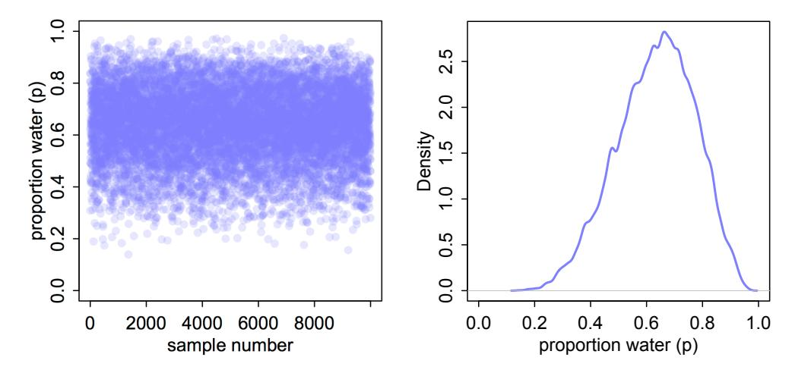
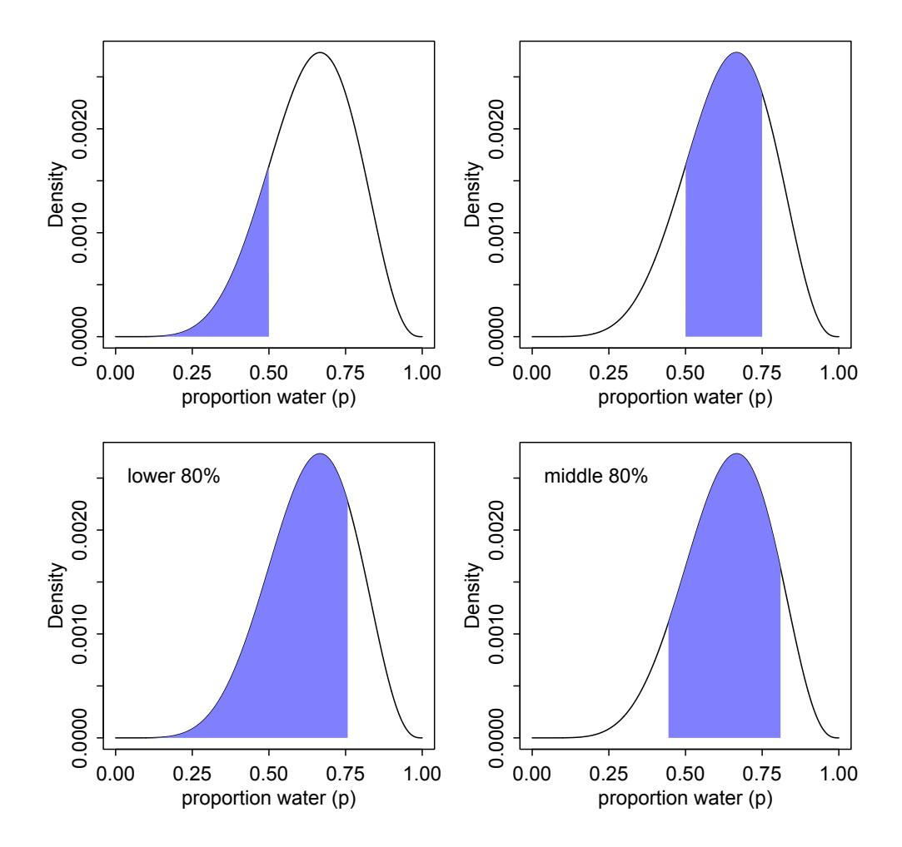
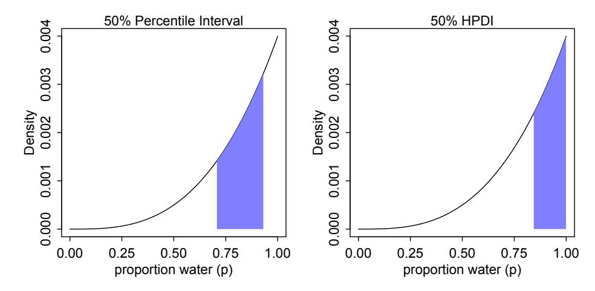
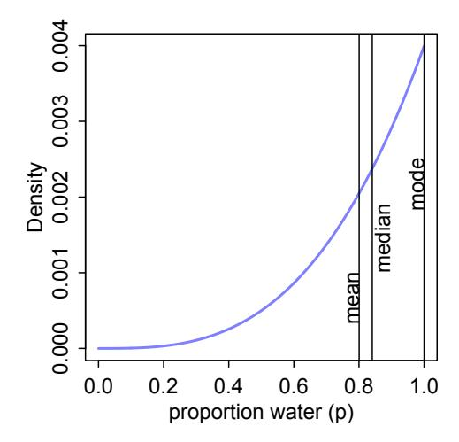
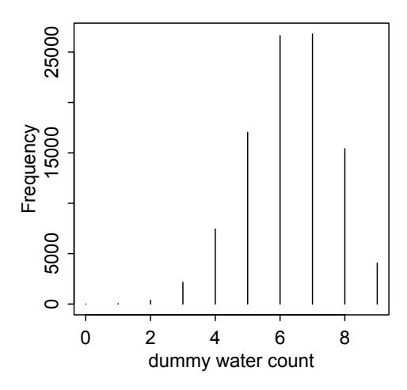
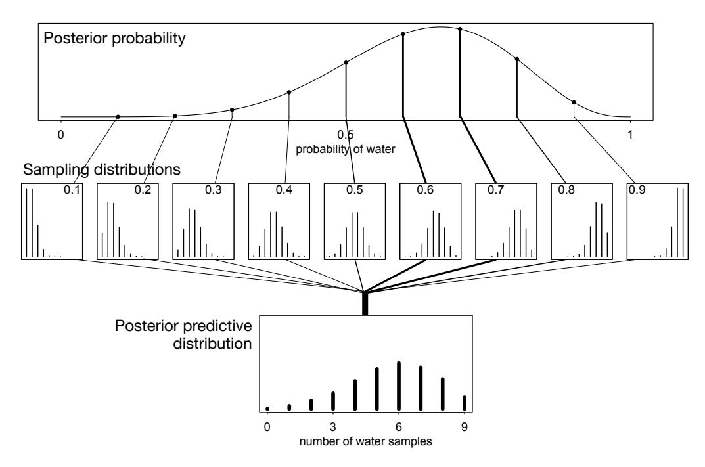
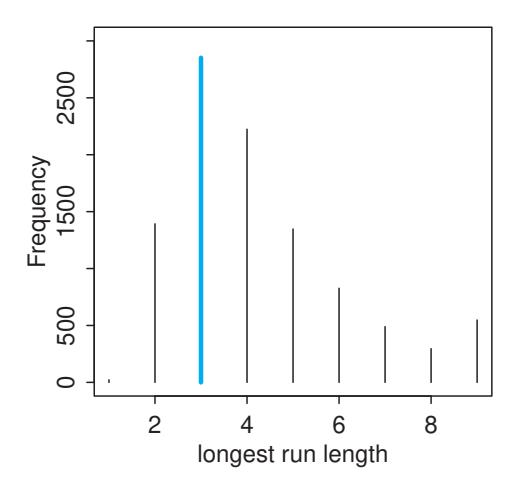
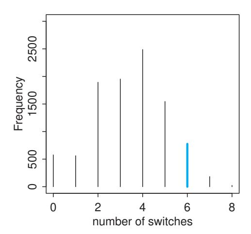

# 3. Amostrando o Imaginário

Muitos livros sobre estatística Bayesiana introduzem a inferência a posteriori usando um cenário de teste médico. Para repetir a estrutura de exemplos comuns, suponha que exista um exame de sangue que detecta corretamente vampirismo em 95% das vezes. Em notação mais precisa e matemática, $Pr(\text{resultado positivo} | \text{vampiro}) = 0{,}95$. É um teste muito preciso, quase sempre detectando vampiros reais. Ele também comete erros, porém, na forma de falsos positivos. Em 1% das vezes, ele diagnostica incorretamente pessoas normais como vampiros, $Pr(\text{resultado positivo} | \text{mortal}) = 0{,}01$. A última informação que nos é dada é que vampiros são bastante raros, compondo apenas 0,1% da população, o que implica $Pr(\text{vampiro}) = 0{,}001$. Suponha agora que alguém teste positivo para vampirismo. Qual é a probabilidade de ele ou ela ser um imortal sugador de sangue?

A abordagem correta é simplesmente usar o teorema de Bayes para inverter a probabilidade, para computar $Pr(\text{vampiro} | \text{positivo})$. O cálculo pode ser apresentado como:

$$Pr(\text{vampiro} | \text{positivo}) = \frac{Pr(\text{positivo} | \text{vampiro}) \, Pr(\text{vampiro})}{Pr(\text{positivo})}$$

onde $Pr(\text{positivo})$ é a probabilidade média de um resultado positivo no teste, isto é,

$$\begin{aligned} Pr(\text{positivo}) &= Pr(\text{positivo} | \text{vampiro}) \, Pr(\text{vampiro}) \\ &+ Pr(\text{positivo} | \text{mortal}) \big( 1 - Pr(\text{vampiro}) \big) \end{aligned}$$

Realizando o cálculo em R:

```r
# R code 3.1
Pr_Positive_Vampire <- 0.95
Pr_Positive_Mortal <- 0.01
Pr_Vampire <- 0.001
Pr_Positive <- Pr_Positive_Vampire * Pr_Vampire +
               Pr_Positive_Mortal * (1 - Pr_Vampire)
Pr_Positive_Vampire * Pr_Vampire / Pr_Positive
```

```
[1] 0.08683729
```

Isso corresponde a uma chance de 8,7% de o suspeito ser de fato um vampiro.

A maioria das pessoas acha esse resultado contraintuitivo. E é um resultado muito importante, porque ele imita a estrutura de muitos contextos de testagem realistas, como testes de HIV e DNA, perfis criminais e até mesmo testes de significância estatística (veja o box Repensando no final desta seção). Sempre que a condição de interesse é muito rara, ter um teste que encontra todos os casos verdadeiros ainda não é garantia de que um resultado positivo carregue muita informação. A razão é que a maioria dos resultados positivos são falsos positivos, mesmo quando todos os verdadeiros positivos são detectados corretamente.

Mas eu não gosto desses exemplos, por duas razões. Primeira, não há nada unicamente "Bayesiano" neles. Lembre-se: a inferência Bayesiana é distinguida por uma visão ampla da probabilidade, não pelo uso do teorema de Bayes. Uma vez que todas as probabilidades que forneci acima se referem a frequências de eventos, em vez de parâmetros teóricos, todas as principais filosofias estatísticas concordariam em usar o teorema de Bayes neste caso. Segunda, e mais importante para o nosso trabalho neste capítulo, esses exemplos fazem a inferência Bayesiana parecer muito mais difícil do que ela precisa ser. Poucas pessoas acham fácil lembrar qual número vai onde, provavelmente porque nunca compreendem a lógica do procedimento. É apenas uma fórmula que desce do céu. Se você está confuso, é apenas porque está tentando entender.

Há uma maneira de apresentar o mesmo problema que o torna mais intuitivo, no entanto. Suponha que, em vez de reportar probabilidades, como antes, eu lhe diga o seguinte:

- (1) Em uma população de 100.000 pessoas, 100 delas são vampiros.
- (2) Dos 100 que são vampiros, 95 deles terão resultado positivo para vampirismo.
- (3) Dos 99.900 mortais, 999 deles terão resultado positivo para vampirismo.

Agora me diga, se testarmos todas as 100.000 pessoas, qual proporção daquelas que testam positivo para vampirismo realmente são vampiros? Muitas pessoas, embora certamente não todas, acham essa apresentação bem mais fácil.$^{49}$ Agora podemos simplesmente contar o número de pessoas que testam positivo: 95 + 999 = 1094. Desses 1094 testes positivos, 95 deles são vampiros reais, então isso implica:

$$Pr(\text{vampiro} | \text{positivo}) = \frac{95}{1094} \approx 0{,}087$$

É exatamente a mesma resposta de antes, mas sem uma regra aparentemente arbitrária.

A segunda apresentação do problema, usando contagens em vez de probabilidades, é frequentemente chamada de formato de frequência ou frequências naturais. Por que um formato de frequência ajuda as pessoas a intuir a abordagem correta permanece controverso. Algumas pessoas pensam que a psicologia humana funciona naturalmente melhor quando recebe informação na forma em que uma pessoa em um ambiente natural a receberia. No mundo real, encontramos apenas contagens. Ninguém jamais viu uma probabilidade, diz o raciocínio. Mas todos veem contagens ("frequências") em suas vidas diárias.

Independentemente da explicação para esse fenômeno, podemos explorá-lo. E neste capítulo nós o exploramos tomando as distribuições de probabilidade do capítulo anterior e amostrando delas para produzir contagens. A distribuição a posteriori é uma distribuição de probabilidade. E como todas as distribuições de probabilidade, podemos imaginar extrair amostras dela. Os eventos amostrados neste caso são valores de parâmetros. A maioria dos parâmetros não tem realização empírica exata. O formalismo Bayesiano trata distribuições de parâmetros como plausibilidade relativa, não como qualquer processo físico aleatório. De qualquer forma, a aleatoriedade é sempre uma propriedade da informação, nunca do mundo real. Mas dentro do computador, parâmetros são tão empíricos quanto o resultado de um lançamento de moeda ou de um dado ou de um experimento agrícola. A distribuição a posteriori define a frequência esperada com que diferentes valores de parâmetros aparecerão, uma vez que comecemos a extraí-los dela.

> **Repensando: O fenômeno das frequências naturais não é único.** Mudar a representação de um problema frequentemente o torna mais fácil de abordar ou inspira novas ideias que não estavam disponíveis em uma representação antiga.$^{50}$ Na física, alternar entre mecânica Newtoniana e Lagrangiana pode tornar problemas muito mais fáceis. Na biologia evolutiva, alternar entre aptidão inclusiva e seleção multinível lança nova luz sobre modelos antigos. E na estatística, alternar entre representações Bayesianas e não-Bayesianas frequentemente nos ensina coisas novas sobre ambas as abordagens.

Este capítulo ensina a você habilidades básicas para trabalhar com amostras da distribuição a posteriori. Parecerá um pouco tolo trabalhar com amostras neste ponto, porque a distribuição a posteriori para o modelo de lançamento do globo é muito simples. Ela é tão simples que não é problema trabalhar diretamente com a aproximação por grade ou mesmo com a forma matemática exata.$^{51}$ Mas há duas razões para adotar a abordagem de amostragem logo cedo, antes que seja realmente necessária.

Primeira, muitos cientistas são bastante inseguros com cálculo integral, embora tenham intuições fortes e válidas sobre como resumir dados. Trabalhar com amostras transforma um problema de cálculo em um problema de resumo de dados, em um problema de formato de frequência. Uma integral em um contexto Bayesiano típico é apenas a probabilidade total em algum intervalo. Isso pode ser um problema de cálculo desafiador. Mas uma vez que você tenha amostras da distribuição de probabilidade, é apenas uma questão de contar valores no intervalo. Mesmo cálculos aparentemente simples, como intervalos de confiança, tornam-se difíceis uma vez que um modelo tenha muitos parâmetros. Nesses casos, é preciso fazer a média sobre a incerteza em todos os outros parâmetros, ao descrever a incerteza em um parâmetro focal. Isso requer uma integral complicada, mas apenas um resumo de dados muito simples. Um ataque empírico à distribuição a posteriori permite que o cientista faça e responda mais perguntas sobre o modelo, sem depender de um matemático cativo. Por essa razão, frequentemente é mais fácil e mais intuitivo trabalhar com amostras da distribuição a posteriori do que trabalhar diretamente com probabilidades e integrais.

Segunda, alguns dos métodos mais capazes de computar a distribuição a posteriori não produzem nada além de amostras. Muitos desses métodos são variantes de técnicas de Monte Carlo via Cadeias de Markov (MCMC, Capítulo 9). Então, se você aprender cedo como conceitualizar e processar amostras da distribuição a posteriori, quando inevitavelmente tiver que ajustar um modelo a dados usando MCMC, você já saberá como interpretar a saída. A partir do Capítulo 9 deste livro, você usará MCMC para abrir os tipos e a complexidade dos modelos que pode ajustar praticamente a dados. MCMC não é mais uma técnica apenas para especialistas, mas sim parte do conjunto de ferramentas padrão da ciência quantitativa. Então vale a pena planejar com antecedência.

Portanto, neste capítulo começaremos a usar amostras para resumir e simular a saída de modelos. As habilidades que você aprende aqui se aplicarão a todo problema no restante do livro, mesmo que os detalhes dos modelos e a forma como as amostras são produzidas variem.

> **Repensando: Por que a estatística não pode salvar a ciência ruim.** O exemplo do vampirismo no início deste capítulo tem a mesma estrutura lógica de muitos problemas diferentes de detecção de sinais: (1) Existe algum estado binário que está oculto de nós; (2) observamos uma pista imperfeita do estado oculto; (3) nós (deveríamos) usar o teorema de Bayes para deduzir logicamente o impacto da pista sobre nossa incerteza.
>
> A inferência científica é frequentemente enquadrada em termos semelhantes: (1) Uma hipótese é verdadeira ou falsa; (2) usamos um procedimento estatístico e obtemos uma pista imperfeita da falsidade da hipótese; (3) nós (deveríamos) usar o teorema de Bayes para deduzir logicamente o impacto da pista sobre o status da hipótese. É o terceiro passo que quase nunca é feito. Mas vamos fazê-lo, para um exemplo simples, para que você possa ver quão pouco os procedimentos estatísticos — Bayesianos ou não — podem fazer por nós.
>
> Suponha que a probabilidade de um achado positivo, quando uma hipótese é verdadeira, seja $Pr(\text{sig} | \text{verdadeira}) = 0{,}95$. Esse é o poder do teste. Suponha que a probabilidade de um achado positivo, quando uma hipótese é falsa, seja $Pr(\text{sig} | \text{falsa}) = 0{,}05$. Essa é a taxa de falsos positivos, como os 5% dos testes de significância convencionais. Finalmente, temos que estabelecer a taxa base com que hipóteses são verdadeiras. Suponha, por exemplo, que 1 em cada 100 hipóteses se revele verdadeira. Então $Pr(\text{verdadeira}) = 0{,}01$. Ninguém sabe esse valor, mas a história da ciência sugere que ele é pequeno. Veja o Capítulo 17 para mais discussão. Agora use Bayes para computar a posteriori:
>
> $$Pr(\text{verdadeira} | \text{pos}) = \frac{Pr(\text{pos} | \text{verdadeira}) \, Pr(\text{verdadeira})}{Pr(\text{pos})} = $$
>
>$$\frac{Pr(\text{pos} | \text{verdadeira}) \, Pr(\text{verdadeira})}{Pr(\text{pos} | \text{verdadeira}) \, Pr(\text{verdadeira}) + Pr(\text{pos} | \text{falsa}) \, Pr(\text{falsa})}$$
>
> Substitua os valores apropriados, e a resposta é aproximadamente $Pr(\text{verdadeira} | \text{pos}) = 0{,}16$. Então um achado positivo corresponde a uma chance de 16% de que a hipótese seja verdadeira. Este é o mesmo fenômeno de baixa taxa base que se aplica em testes médicos (e de vampiros). Você pode reduzir a taxa de falsos positivos para 1% e elevar essa probabilidade a posteriori para 0,5, apenas tão boa quanto um lançamento de moeda. A coisa mais importante a fazer é melhorar a taxa base, $Pr(\text{verdadeira})$, e isso requer pensar, não testar.$^{52}$

## 3.1. Amostragem a partir de uma posteriori por aproximação em grade

Antes de começar a trabalhar com amostras, precisamos gerá-las. Aqui está um lembrete de como computar a distribuição a posteriori para o modelo de lançamento do globo, usando aproximação por grade. Lembre-se, a *posteriori* aqui significa a probabilidade de $p$ condicional aos dados.

```r
# R code 3.2
p_grid <- seq( from=0 , to=1 , length.out=1000 )
prob_p <- rep( 1 , 1000 )
prob_data <- dbinom( 6 , size=9 , prob=p_grid )
posterior <- prob_data * prob_p
posterior <- posterior / sum(posterior)
```

Agora desejamos extrair 10.000 amostras desta distribuição a posteriori. Imagine que a posteriori é um balde cheio de valores de parâmetros, números como 0,1, 0,7, 0,5, 1, etc. Dentro do balde, cada valor existe em proporção à sua probabilidade a posteriori, de modo que valores próximos ao pico são muito mais comuns do que aqueles nas caudas. Vamos retirar 10.000 valores do balde. Desde que o balde esteja bem misturado, as amostras resultantes terão as mesmas proporções que a densidade posterior exata. Portanto, os valores individuais de $p$ aparecerão em nossas amostras em proporção à plausibilidade a posteriori de cada valor.

Veja como você pode fazer isso em R, com uma única linha de código:

```r
# R code 3.3
samples <- sample( p_grid , prob=posterior , size=1e4 , replace=TRUE )
```

O carro-chefe aqui é `sample`, que extrai aleatoriamente valores de um vetor. O vetor neste caso é `p_grid`, a grade de valores de parâmetros. A probabilidade de cada valor é dada por `posterior`, que você computou logo acima.

As amostras resultantes são exibidas na Figura 3.1. À esquerda, todas as 10.000 (1e4) amostras aleatórias são mostradas sequencialmente.

```r
# R code 3.4
plot( samples )
```

Neste gráfico, é como se você estivesse sobrevoando a distribuição a posteriori, olhando para baixo. Há muito mais amostras da região densa próxima a 0,6 e muito poucas amostras abaixo de 0,25. À direita, o gráfico mostra a *estimativa de densidade* computada a partir dessas amostras.

```r
# R code 3.5
dens( samples )
```



**FIGURA 3.1.** Amostrando valores de parâmetros da distribuição a posteriori. Esquerda: 10.000 amostras da distribuição a posteriori implícita pelos dados e modelo de lançamento do globo. Direita: A densidade das amostras (vertical) em cada valor de parâmetro (horizontal).

Você pode ver que a densidade estimada é muito similar à distribuição a posteriori ideal que você computou via aproximação por grade. Se você extrair ainda mais amostras, talvez 1e5 ou 1e6, a estimativa de densidade ficará cada vez mais similar ao ideal.

Tudo o que você fez até agora é replicar grosseiramente a densidade posterior que já havia computado. Isso não é de muito valor. Mas a seguir é hora de usar essas amostras para descrever e compreender a distribuição a posteriori. Isso é de grande valor.

## 3.2. Amostrando para resumir

Uma vez que seu modelo produz uma distribuição a posteriori, o trabalho do modelo está feito. Mas o seu trabalho apenas começou. É necessário resumir e interpretar a distribuição a posteriori. Exatamente como ela é resumida depende do seu propósito. Mas perguntas comuns incluem:

- Quanta probabilidade a posteriori está abaixo de algum valor de parâmetro?
- Quanta probabilidade a posteriori está entre dois valores de parâmetros?
- Qual valor de parâmetro marca os 5% inferiores da probabilidade a posteriori?
- Qual intervalo de valores de parâmetros contém 90% da probabilidade a posteriori?
- Qual valor de parâmetro tem a maior probabilidade a posteriori?

Essas perguntas simples podem ser utilmente divididas em perguntas sobre (1) intervalos de limites *definidos*, (2) perguntas sobre intervalos de *massa de probabilidade definida* e (3) perguntas sobre estimativas pontuais. Veremos como abordar essas perguntas usando amostras da distribuição a posteriori.

### 3.2.1. Intervalos de limites definidos

Suponha que eu lhe peça a probabilidade a posteriori de que a proporção de água seja menor que 0,5. Usando a posteriori aproximada por grade, você pode simplesmente somar todas as probabilidades onde o valor de parâmetro correspondente é menor que 0,5:

```r
# R code 3.6
# add up posterior probability where p < 0.5
sum( posterior[ p_grid < 0.5 ] )
```

```
[1] 0.1718746
```

Então cerca de 17% da probabilidade a posteriori está abaixo de 0,5. Não poderia ser mais fácil. Mas como a aproximação por grade não é prática em geral, nem sempre será tão fácil. Uma vez que haja mais de um parâmetro na distribuição a posteriori (espere pelo próximo capítulo para essa complicação), mesmo essa soma simples deixa de ser muito simples.

Então vamos ver como realizar o mesmo cálculo usando amostras da distribuição a posteriori. Essa abordagem generaliza para modelos complexos com muitos parâmetros, e portanto você pode usá-la em toda parte. Tudo o que você precisa fazer é similarmente somar todas as amostras abaixo de 0,5, mas também dividir a contagem resultante pelo número total de amostras. Em outras palavras, encontre a frequência de valores de parâmetros abaixo de 0,5:

```r
# R code 3.7
sum( samples < 0.5 ) / 1e4
```

```
[1] 0.1726
```

E essa é quase a mesma resposta que a aproximação por grade forneceu, embora sua resposta não seja exatamente a mesma, porque as amostras exatas que você extraiu da distribuição a posteriori serão diferentes. Essa região é mostrada no gráfico superior esquerdo na Figura 3.2. Usando a mesma abordagem, você pode perguntar quanta probabilidade a posteriori está entre 0,5 e 0,75:

```r
# R code 3.8
sum( samples > 0.5 & samples < 0.75 ) / 1e4
```

```
[1] 0.6059
```

Então cerca de 61% da probabilidade a posteriori está entre 0,5 e 0,75. Essa região é mostrada no gráfico superior direito da Figura 3.2.

> [!NOTE]
> **Pensando Mais um Pouco: Contando com sum.** Nos exemplos de código R logo acima, usei a função `sum` para efetivamente contar quantas amostras satisfazem um critério lógico. Por que isso funciona? Funciona porque R internamente converte uma expressão lógica, como `samples < 0.5`, em um vetor de resultados TRUE e FALSE, um para cada elemento de `samples`, dizendo se cada elemento corresponde ou não ao critério. Vá em frente e digite `samples < 0.5` no prompt do R, para ver isso por você mesmo. Então, quando você aplica `sum` nesse vetor de TRUE e FALSE, R conta cada TRUE como 1 e cada FALSE como 0. Assim, acaba contando quantos valores TRUE existem no vetor, o que é o mesmo que o número de elementos em `samples` que correspondem ao critério lógico.

### 3.2.2. Intervalos de massa definida

É mais comum ver periódicos científicos reportando um intervalo de massa definida, normalmente conhecido como **intervalo de confiança**. Um intervalo de probabilidade a posteriori, como aqueles com os quais estamos trabalhando, pode em vez disso ser chamado de **intervalo de credibilidade**. Nós vamos chamá-lo de **intervalo de compatibilidade**, a fim de evitar as implicações injustificadas de "confiança" e "credibilidade".$^{53}$ O que o intervalo indica é um conjunto de valores de parâmetros compatíveis com o modelo e os dados. O modelo e os dados em si podem não inspirar confiança, caso em que o intervalo tampouco inspirará.

Esses intervalos a posteriori reportam dois valores de parâmetros que contêm entre si uma quantidade especificada de probabilidade a posteriori, uma massa de probabilidade. Para esse tipo de intervalo, é mais fácil encontrar a resposta usando amostras da distribuição a posteriori do que usando uma aproximação por grade.



**FIGURA 3.2.** Dois tipos de intervalo posterior. Linha superior: Intervalos de limites definidos. Superior esquerdo: A área azul é a probabilidade a posteriori abaixo de um valor de parâmetro de 0,5. Superior direito: A probabilidade a posteriori entre 0,5 e 0,75. Linha inferior: Intervalos de massa definida. Inferior esquerdo: 80% inferiores da probabilidade a posteriori existem abaixo de um valor de parâmetro de aproximadamente 0,75. Inferior direito: 80% centrais da probabilidade a posteriori estão entre os quantis de 10% e 90%.

Suponha, por exemplo, que você queira saber os limites dos 80% inferiores da probabilidade a posteriori. Você sabe que esse intervalo começa em $p = 0$. Para descobrir onde ele termina, pense nas amostras como dados e pergunte onde está o percentil 80:

```r
# R code 3.9
quantile( samples , 0.8 )
```

```
      80%
0.7607608
```

Essa região é mostrada no gráfico inferior esquerdo na Figura 3.2. Similarmente, o intervalo central de 80% está entre o percentil 10 e o percentil 90. Esses limites são encontrados usando a mesma abordagem:

```r
# R code 3.10
quantile( samples , c( 0.1 , 0.9 ) )
```

```
       10%        90%
0.4464464  0.8118118
```

Essa região é mostrada no gráfico inferior direito da Figura 3.2.

Intervalos desse tipo, que atribuem massa de probabilidade igual a cada cauda, são muito comuns na literatura científica. Nós os chamaremos de **intervalos percentílicos** (PI). Esses intervalos fazem um bom trabalho ao comunicar a forma de uma distribuição, desde que a distribuição não seja muito assimétrica. Mas em termos de apoiar inferências sobre quais parâmetros são consistentes com os dados, eles não são perfeitos. Considere a distribuição a posteriori e os diferentes intervalos na Figura 3.3. Essa distribuição a posteriori é consistente com a observação de três águas em três lançamentos e uma distribuição a priori uniforme (plana). Ela é altamente assimétrica, tendo seu valor máximo no limite, $p = 1$. Você pode computá-la, via aproximação por grade, com:

```r
# R code 3.11
p_grid <- seq( from=0 , to=1 , length.out=1000 )
prior <- rep(1,1000)
likelihood <- dbinom( 3 , size=3 , prob=p_grid )
posterior <- likelihood * prior
posterior <- posterior / sum(posterior)
samples <- sample( p_grid , size=1e4 , replace=TRUE , prob=posterior )
```

Esse código também prossegue para amostrar da distribuição a posteriori. Agora, à esquerda da Figura 3.3, o intervalo de compatibilidade percentílico de 50% está sombreado. Você pode computar isso convenientemente a partir das amostras com `PI` (parte do pacote `rethinking`):

```r
# R code 3.12
PI( samples , prob=0.5 )
```

Esse intervalo atribui 25% da massa de probabilidade acima e abaixo do intervalo. Então ele fornece os 50% centrais da probabilidade. Mas neste exemplo, ele acaba excluindo os valores de parâmetros mais prováveis, próximos a $p = 1$. Assim, em termos de descrever a forma da distribuição a posteriori — que é realmente tudo o que esses intervalos são convidados a fazer — o intervalo percentílico pode ser enganoso.

Em contraste, o gráfico à direita na Figura 3.3 exibe o **intervalo de maior densidade a posteriori** (HPDI) de 50%.$^{56}$ O HPDI é o intervalo mais estreito que contém a massa de probabilidade especificada. Se você pensar sobre isso, deve haver um número infinito de intervalos a posteriori com a mesma massa. Mas se você quer um intervalo que melhor represente os valores de parâmetros mais consistentes com os dados, então você quer o mais denso desses intervalos. Isso é o que o HPDI é. Compute-o a partir das amostras com `HPDI` (também parte do pacote `rethinking`):

```r
# R code 3.13
HPDI( samples , prob=0.5 )
```

```
     |0.5      0.5|
0.7037037  0.9329329
```



**FIGURA 3.3.** A diferença entre intervalos de compatibilidade percentílicos e de maior densidade a posteriori. A densidade posterior aqui corresponde a uma distribuição a priori plana e à observação de três amostras de água em três lançamentos totais do globo. Esquerda: Intervalo percentílico de 50%. Esse intervalo atribui massa igual (25%) a ambas as caudas esquerda e direita. Como resultado, ele omite o valor de parâmetro mais provável, $p = 1$. Direita: Intervalo de maior densidade a posteriori de 50%, HPDI. Esse intervalo encontra a região mais estreita com 50% da probabilidade a posteriori. Tal região sempre inclui o valor de parâmetro mais provável.

Esse intervalo captura os parâmetros com maior probabilidade a posteriori, além de ser notavelmente mais estreito: 0,16 de largura em vez de 0,23 para o intervalo percentílico.

> **Repensando: Por que 95%?** A massa de intervalo mais comum nas ciências naturais e sociais é o intervalo de 95%. Esse intervalo deixa 5% da probabilidade de fora, correspondendo a uma chance de 5% de o parâmetro não estar dentro do intervalo (embora veja abaixo). Esse intervalo costumeiro também reflete o limiar costumeiro para significância estatística, que é 5% ou $p < 0{,}05$. Não é fácil defender a escolha de 95% (5%), fora de apelos à convenção. Ronald Fisher às vezes é culpado por essa escolha, mas sua amplamente citada invocação de 1925 não foi entusiástica:
>
> "O [número de desvios padrão] para o qual P = ,05, ou 1 em 20, é 1,96 ou quase 2; é conveniente tomar este ponto como limite para julgar se um desvio deve ser considerado significativo ou não."$^{54}$
>
> A maioria das pessoas não pensa em conveniência como um critério sério. Mais tarde em sua carreira, Fisher ativamente desaconselhou usar sempre o mesmo limiar para significância.$^{55}$

Então o que você deveria fazer? Não há consenso, mas pensar é sempre uma boa ideia. Se você está tentando dizer que um intervalo não inclui algum valor, então pode usar o intervalo mais amplo que exclui o valor. Frequentemente, tudo o que intervalos de compatibilidade fazem é comunicar a forma de uma distribuição. Nesse caso, uma série de intervalos aninhados pode ser mais útil do que qualquer intervalo único. Por exemplo, por que não apresentar intervalos de 67%, 89% e 97%, junto com a mediana? Por que esses valores? Nenhuma razão. Eles são números primos, o que os torna fáceis de lembrar. Mas tudo o que importa é que sejam suficientemente espaçados para ilustrar a forma da distribuição a posteriori. E esses valores evitam 95%, uma vez que intervalos convencionais de 95% encorajam muitos leitores a conduzir testes de hipóteses inconscientes.

Portanto, o HPDI tem algumas vantagens sobre o PI. Mas na maioria dos casos, esses dois tipos de intervalo são muito semelhantes.$^{57}$ Eles só parecem tão diferentes neste caso porque a distribuição a posteriori é altamente assimétrica. Se em vez disso usássemos amostras da distribuição a posteriori para seis águas em nove lançamentos, esses intervalos seriam quase idênticos. Tente você mesmo, usando diferentes massas de probabilidade, como `prob=0.8` e `prob=0.95`. Quando a distribuição a posteriori tem forma de sino, pouco importa qual tipo de intervalo você usa. Lembre-se, não estamos lançando foguetes ou calibrando esmagadores de átomos, então fetichizar precisão até a 5ª casa decimal não vai melhorar sua ciência.

O HPDI também tem algumas desvantagens. O HPDI é mais intensivo computacionalmente que o PI e sofre de maior variância de simulação, o que é uma maneira sofisticada de dizer que ele é sensível a quantas amostras você extrai da distribuição a posteriori. Ele também é mais difícil de entender e muitas audiências científicas não apreciarão suas características, enquanto compreenderão imediatamente um intervalo percentílico, já que intervalos não-Bayesianos comuns são tipicamente interpretados (incorretamente) como intervalos percentílicos (embora veja o box Repensando abaixo).

No geral, se a escolha do tipo de intervalo faz grande diferença, então você não deveria estar usando intervalos para resumir a distribuição a posteriori. Lembre-se, a distribuição a posteriori inteira é a "estimativa" Bayesiana. Ela resume as plausibilidades relativas de cada valor possível do parâmetro. Intervalos da distribuição são apenas úteis para resumi-la. Se a escolha do intervalo leva a inferências diferentes, então seria melhor simplesmente plotar toda a distribuição a posteriori.

> **Repensando: O que intervalos de compatibilidade significam?** É comum ouvir que um intervalo de "confiança" de 95% significa que há uma probabilidade de 0,95 de que o verdadeiro valor do parâmetro esteja dentro do intervalo. Na inferência estatística não-Bayesiana estrita, tal afirmação nunca é correta, porque a inferência não-Bayesiana estrita proíbe o uso de probabilidade para medir incerteza sobre parâmetros. Em vez disso, deve-se dizer que se repetíssemos o estudo e a análise um número muito grande de vezes, então 95% dos intervalos computados conteriam o verdadeiro valor do parâmetro. Se a distinção não é totalmente clara para você, então você está em boa companhia. A maioria dos cientistas acha a definição de um intervalo de confiança desconcertante, e muitos deles escorregam inconscientemente para uma interpretação Bayesiana.
>
> Mas quer você use uma interpretação Bayesiana ou não, um intervalo de 95% não contém o valor verdadeiro 95% das vezes. A história da ciência nos ensina que intervalos de confiança exibem excesso de confiança crônico.$^{58}$ A palavra *verdadeiro* deveria fazer soar alarmes de que algo está errado com uma afirmação como "contém o valor verdadeiro". Os 95% são um número de mundo pequeno (veja a introdução ao Capítulo 2), verdadeiro apenas no mundo lógico do modelo. Então ele nunca se aplicará exatamente ao mundo real ou mundo grande. É no que o golem acredita, mas você é livre para acreditar em outra coisa. De qualquer forma, a largura do intervalo, e os valores que ele cobre, podem fornecer conselhos valiosos.

### 3.2.3. Estimativas pontuais

A terceira e última tarefa comum de resumo para a distribuição a posteriori é produzir estimativas pontuais de algum tipo. Dada toda a distribuição a posteriori, que valor você deveria reportar? Essa parece uma pergunta inocente, mas é difícil de responder. A estimativa Bayesiana de parâmetro é precisamente toda a distribuição a posteriori, que não é um número único, mas sim uma função que mapeia cada valor de parâmetro único em um valor de plausibilidade. Então, realmente, a coisa mais importante a notar é que você não precisa escolher uma estimativa pontual. Isso raramente é necessário e frequentemente é prejudicial. Descarta informação.

Mas se você precisa produzir um único ponto para resumir a distribuição a posteriori, terá que fazer e responder mais perguntas. Considere o exemplo a seguir. Suponha novamente o experimento de lançamento do globo em que observamos 3 águas de 3 lançamentos, como na Figura 3.3. Vamos considerar três estimativas pontuais alternativas. Primeiro, é muito comum cientistas reportarem o valor de parâmetro com maior probabilidade a posteriori, uma estimativa de *máximo a posteriori* (MAP). Você pode facilmente computar o MAP neste exemplo:

```r
# R code 3.14
p_grid[ which.max(posterior) ]
```

```
[1] 1
```

Ou se em vez disso você tem amostras da distribuição a posteriori, pode ainda assim aproximar o mesmo ponto:

```r
# R code 3.15
chainmode( samples , adj=0.01 )
```

```
[1] 0.9985486
```

Mas por que esse ponto, a moda, é interessante? Por que não reportar a média ou mediana a posteriori?

```r
# R code 3.16
mean( samples )
median( samples )
```

```
[1] 0.8005558
[1] 0.8408408
```

Essas também são estimativas pontuais, e elas também resumem a distribuição a posteriori. Mas todas as três — a moda (MAP), média e mediana — são diferentes neste caso. Como podemos escolher entre elas? A Figura 3.4 mostra essa distribuição a posteriori e as localizações desses resumos pontuais.

Uma maneira principiada de ir além de usar toda a distribuição a posteriori como estimativa é escolher uma **função de perda**. Uma função de perda é uma regra que lhe diz o custo associado ao uso de qualquer estimativa pontual particular. Embora estatísticos e teóricos dos jogos há muito se interessem por funções de perda, e por como a inferência Bayesiana as apoia, cientistas quase nunca as usam explicitamente. A percepção fundamental é que *diferentes funções de perda implicam diferentes estimativas pontuais*.

Aqui está um exemplo para nos ajudar a trabalhar pelo procedimento. Suponha que eu lhe ofereça uma aposta. Diga-me qual valor de $p$, a proporção de água na Terra, você acha que é correto. Eu pagarei \$100, se você acertar exatamente. Mas eu subtrairei dinheiro do seu ganho, proporcional à distância de sua decisão do valor correto. Precisamente, sua perda é proporcional ao valor absoluto de $d - p$, onde $d$ é sua decisão e $p$ é a resposta correta. Poderíamos mudar os valores exatos em dólares envolvidos, sem mudar os aspectos importantes deste problema. O que importa é que a perda é proporcional à distância de sua decisão do valor verdadeiro.

Agora, uma vez que você tenha a distribuição a posteriori em mãos, como deveria usá-la para maximizar seus ganhos esperados? Acontece que o valor de parâmetro que maximiza os ganhos esperados (minimiza a perda esperada) é a mediana da distribuição a posteriori. Vamos calcular esse fato, sem usar uma prova matemática. Aqueles interessados na prova devem seguir a nota de fim.$^{59}$

Calcular a perda esperada para qualquer decisão dada significa usar a distribuição a posteriori para fazer a média sobre nossa incerteza no valor verdadeiro. É claro que não sabemos o valor verdadeiro, na maioria dos casos. Mas se vamos usar a informação do nosso modelo sobre o parâmetro, isso significa usar toda a distribuição a posteriori. Então suponha que decidimos que $p = 0{,}5$ será nossa decisão. Então a perda esperada será:




**FIGURA 3.4.** Estimativas pontuais e funções de perda. Esquerda: Distribuição a posteriori (azul) após observar 3 águas em 3 lançamentos do globo. Linhas verticais mostram as localizações da moda, mediana e média. Cada ponto implica uma função de perda diferente. Direita: Perda esperada sob a regra de que a perda é proporcional à distância absoluta da decisão (eixo horizontal) do valor verdadeiro. O ponto marca o valor de $p$ que minimiza a perda esperada, a mediana a posteriori.

```r
# R code 3.17
sum( posterior*abs( 0.5 - p_grid ) )
```

```
[1] 0.3128752
```

Os símbolos `posterior` e `p_grid` são os mesmos que temos usado ao longo deste capítulo, contendo as probabilidades a posteriori e os valores de parâmetros, respectivamente. Tudo o que o código acima faz é computar a perda média ponderada, onde cada perda é ponderada por sua probabilidade a posteriori correspondente. Há um truque para repetir esse cálculo para cada decisão possível, usando a função `sapply`.

```r
# R code 3.18
loss <- sapply( p_grid , function(d) sum( posterior*abs( d - p_grid ) ) )
```

Agora o símbolo `loss` contém uma lista de valores de perda, uma para cada decisão possível, correspondendo aos valores em `p_grid`. A partir daqui, é fácil encontrar o valor de parâmetro que minimiza a perda:

```r
# R code 3.19
p_grid[ which.min(loss) ]
```

```
[1] 0.8408408
```

E isso é na verdade a mediana a posteriori, o valor de parâmetro que divide a densidade posterior de modo que metade da massa esteja acima dele e metade abaixo. Tente `median(samples)` para comparação. Pode não ser exatamente o mesmo valor, devido à variação amostral, mas será próximo.

Então o que devemos aprender com tudo isso? Para decidir sobre uma estimativa pontual, um resumo de valor único da distribuição a posteriori, precisamos escolher uma função de perda. Diferentes funções de perda nomeiam diferentes estimativas pontuais. Os dois exemplos mais comuns são a perda absoluta como acima, que leva à mediana como estimativa pontual, e a perda quadrática $(d - p)^2$, que leva à média a posteriori (`mean(samples)`) como estimativa pontual. Quando a distribuição a posteriori é simétrica e com aparência normal, então a mediana e a média convergem para o mesmo ponto, o que alivia alguma ansiedade que possamos ter sobre escolher uma função de perda. Para os dados originais de lançamento do globo (6 águas em 9 lançamentos), por exemplo, a média e a mediana são quase idênticas.

Em princípio, porém, os detalhes do contexto aplicado podem demandar uma função de perda bastante única. Considere um exemplo prático como decidir se ordena ou não uma evacuação, com base em uma estimativa de velocidade do vento de um furacão. O dano à vida e à propriedade aumenta muito rapidamente conforme a velocidade do vento aumenta. Há também custos em ordenar uma evacuação quando nenhuma é necessária, mas esses são muito menores. Portanto, a função de perda implícita é altamente assimétrica, subindo acentuadamente conforme a velocidade verdadeira do vento excede nosso palpite, mas subindo apenas lentamente conforme a velocidade verdadeira do vento cai abaixo do nosso palpite. Nesse contexto, a estimativa pontual ótima tenderia a ser maior do que a média ou mediana a posteriori. Além disso, a questão real é se ordena ou não uma evacuação, e portanto produzir uma estimativa pontual de velocidade do vento pode não ser necessário de todo.

Normalmente, cientistas pesquisadores não pensam sobre funções de perda. E assim qualquer estimativa pontual como a média ou MAP que eles possam reportar não tem a intenção de apoiar nenhuma decisão particular, mas sim de descrever a forma da distribuição a posteriori. Você poderia argumentar que a decisão a tomar é se aceita ou rejeita uma hipótese. Mas o desafio então é dizer quais seriam os custos e benefícios relevantes, em termos do conhecimento ganho ou perdido.$^{60}$ Normalmente é melhor comunicar o máximo que puder sobre a distribuição a posteriori, assim como os dados e o modelo em si, para que outros possam construir sobre o seu trabalho. Decisões prematuras de aceitar ou rejeitar hipóteses podem custar vidas.$^{61}$

É saudável manter essas questões em mente, nem que seja porque elas nos lembram que muitas das perguntas rotineiras na inferência estatística só podem ser respondidas sob consideração de um contexto empírico particular e um propósito aplicado. Estatísticos podem fornecer contornos gerais e respostas padrão, mas um cientista motivado e atento sempre será capaz de melhorar sobre tais conselhos gerais.

## 3.3. Amostrando para simular predição

Outro trabalho comum para amostras é facilitar a **simulação** das observações implícitas do modelo. Gerar observações implícitas de um modelo é útil por pelo menos quatro razões distintas.

- (1) *Design de modelo.* Podemos amostrar não apenas da distribuição a posteriori, mas também da distribuição a priori. Ver o que o modelo espera, antes que os dados cheguem, é a melhor maneira de entender as implicações da distribuição a priori. Faremos muito disso em capítulos posteriores, onde haverá múltiplos parâmetros e portanto suas implicações conjuntas nem sempre são muito claras.
- (2) *Verificação do modelo.* Depois que um modelo é atualizado usando dados, vale a pena simular observações implícitas, para verificar tanto se o ajuste funcionou corretamente quanto para investigar o comportamento do modelo.
- (3) *Validação de software.* Para ter certeza de que nosso software de ajuste de modelo está funcionando, ajuda simular observações sob um modelo conhecido e então tentar recuperar os valores dos parâmetros sob os quais os dados foram simulados.
- (4) *Design de pesquisa.* Se você pode simular observações a partir da sua hipótese, então pode avaliar se o design de pesquisa pode ser eficaz. Em um sentido restrito, isso significa fazer análise de poder, mas as possibilidades são muito mais amplas.
- (5) *Previsão.* Estimativas podem ser usadas para simular novas predições, para novos casos e observações futuras. Essas previsões podem ser úteis como predição aplicada, mas também para crítica e revisão de modelos.

Nesta seção final do capítulo, veremos como produzir observações simuladas e como realizar algumas verificações simples de modelo.

### 3.3.1. Dados fictícios

Vamos resumir o modelo de lançamento do globo com o qual você tem trabalhado por dois capítulos. Uma proporção verdadeira fixa de água $p$ existe, e esse é o alvo da nossa inferência. Lançar o globo ao ar e agarrá-lo produz observações de "água" e "terra" que aparecem em proporção a $p$ e $1 - p$, respectivamente.

Agora note que essas suposições não apenas nos permitem inferir a plausibilidade de cada valor possível de $p$, após observação. Isso é o que você fez no capítulo anterior. Essas suposições também nos permitem simular as observações que o modelo implica. Elas permitem isso porque funções de verossimilhança funcionam em ambas as direções. Dada uma observação realizada, a função de verossimilhança diz quão plausível é a observação. E dados apenas os parâmetros, a verossimilhança define uma distribuição de observações possíveis das quais podemos amostrar, para simular observação. Dessa forma, modelos Bayesianos são sempre generativos, capazes de simular predições. Muitos modelos não-Bayesianos também são generativos, mas muitos não são.

Chamaremos tais dados simulados de **dados fictícios**, para indicar que são substitutos dos dados reais. Com o modelo de lançamento do globo, os dados fictícios surgem de uma verossimilhança binomial:

$$Pr(W | N, p) = \frac{N!}{W!(N-W)!} \, p^{W} (1-p)^{N-W}$$

onde $W$ é uma contagem observada de "água" e $N$ é o número de lançamentos. Suponha $N = 2$, dois lançamentos do globo. Então há apenas três observações possíveis: 0 água, 1 água, 2 água. Você pode rapidamente computar a probabilidade de cada uma, para qualquer valor dado de $p$. Vamos usar $p = 0{,}7$, que é aproximadamente a verdadeira proporção de água na Terra:

```r
# R code 3.20
dbinom( 0:2 , size=2 , prob=0.7 )
```

```
[1] 0.09 0.42 0.49
```

Isso significa que há 9% de chance de observar $w = 0$, 42% de chance de $w = 1$ e 49% de chance de $w = 2$. Se você mudar o valor de $p$, obterá uma distribuição diferente de observações implícitas.

Agora vamos simular observações, usando essas probabilidades. Isso é feito amostrando da distribuição descrita acima. Você poderia usar `sample` para fazer isso, mas R fornece funções de amostragem convenientes para todas as distribuições de probabilidade comuns, como a binomial. Então uma única observação de dados fictícios de $W$ pode ser amostrada com:

```r
# R code 3.21
rbinom( 1 , size=2 , prob=0.7 )
```

```
[1] 1
```

Esse 1 significa "1 água em 2 lançamentos". O "r" em `rbinom` significa "random" (aleatório). Ele também pode gerar mais de uma simulação por vez. Um conjunto de 10 simulações pode ser feito por:

```r
# R code 3.22
rbinom( 10 , size=2 , prob=0.7 )
```

```
[1] 2 2 2 1 2 1 1 1 0 2
```



**FIGURA 3.5.** Distribuição de observações amostrais simuladas de 9 lançamentos do globo. Essas amostras assumem que a proporção de água é 0,7.

Vamos gerar 100.000 observações fictícias, apenas para verificar que cada valor (0, 1 ou 2) aparece em proporção à sua verossimilhança:

```r
# R code 3.23
dummy_w <- rbinom( 1e5 , size=2 , prob=0.7 )
table(dummy_w)/1e5
```

```
dummy_w
      0       1       2
0.08904 0.41948 0.49148
```

E esses valores estão muito próximos das verossimilhanças calculadas analiticamente mais acima. Você verá valores ligeiramente diferentes, devido à variância de simulação. Execute o código acima múltiplas vezes, para ver como as frequências exatas realizadas flutuam de simulação para simulação.

Apenas dois lançamentos do globo não é muita amostra, porém. Então agora vamos simular o mesmo tamanho de amostra de antes, 9 lançamentos.

```r
# R code 3.24
dummy_w <- rbinom( 1e5 , size=9 , prob=0.7 )
simplehist( dummy_w , xlab="dummy water count" )
```

O gráfico resultante é mostrado na Figura 3.5. Note que na maioria das vezes a observação esperada não contém água na sua verdadeira proporção, 0,7. Essa é a natureza da observação: Há uma relação de um-para-muitos entre dados e processos geradores de dados. Você deveria experimentar com o tamanho da amostra, o argumento `size` no código acima, assim como o `prob`, para ver como a distribuição de amostras simuladas muda de forma e localização.

Então é assim que se realiza uma simulação básica de observações. Para que isso serve? Há muitos trabalhos úteis para essas amostras. Neste capítulo, nós as colocaremos em uso examinando as predições implícitas de um modelo. Mas para fazer isso, teremos que combiná-las com amostras da distribuição a posteriori. Isso é o próximo.

> **Repensando: Distribuições amostrais.** Muitos leitores já terão visto observações simuladas. **Distribuições amostrais** são a fundação das tradições estatísticas não-Bayesianas comuns. Nessas abordagens, a inferência sobre parâmetros é feita através da distribuição amostral. Neste livro, a inferência sobre parâmetros nunca é feita diretamente através de uma distribuição amostral. A distribuição a posteriori não é amostrada, mas deduzida logicamente. Então amostras podem ser extraídas da distribuição a posteriori, como anteriormente neste capítulo, para auxiliar na inferência. Em nenhum dos casos a "amostragem" é um ato físico. Em ambos os casos, é apenas um dispositivo matemático e produz apenas números de mundo pequeno (Capítulo 2).

### 3.3.2. Verificação do modelo

**Verificação do modelo** significa (1) assegurar que o ajuste do modelo funcionou corretamente e (2) avaliar a adequação de um modelo para algum propósito. Uma vez que modelos Bayesianos são sempre generativos, capazes de simular observações assim como estimar parâmetros a partir de observações, uma vez que você condiciona um modelo nos dados, pode simular para examinar as expectativas empíricas do modelo.

#### 3.3.2.1. O software funcionou?

No caso mais simples, podemos verificar se o software funcionou checando a correspondência entre predições implícitas e os dados usados para ajustar o modelo. Você também pode chamar essas predições implícitas de *retrodições*, pois elas perguntam quão bem o modelo reproduz os dados usados para educá-lo. Uma correspondência exata não é esperada nem desejada. Mas quando não há correspondência alguma, provavelmente significa que o software fez algo errado.

Não há maneira de realmente ter certeza de que o software funciona corretamente. Mesmo quando as retrodições correspondem aos dados observados, pode haver erros sutis. E quando você começar a trabalhar com modelos multinível, terá que esperar um certo padrão de falta de correspondência entre retrodições e observações. Apesar de não haver uma maneira perfeita de assegurar que o software funcionou, a verificação simples que estou encorajando aqui frequentemente detecta erros bobos, erros do tipo que todos cometem de tempos em tempos.

No caso da análise de lançamento do globo, a implementação do software é simples o suficiente para poder ser verificada contra resultados analíticos. Então, em vez disso, vamos passar diretamente a considerar a adequação do modelo.

#### 3.3.2.2. O modelo é adequado?

Após avaliar se a distribuição a posteriori é a correta, porque o software funcionou corretamente, é útil também buscar por aspectos dos dados que não são bem descritos pelas expectativas do modelo. O objetivo não é testar se as suposições do modelo são "verdadeiras", porque todos os modelos são falsos. Em vez disso, o objetivo é avaliar exatamente como o modelo falha em descrever os dados, como um caminho para compreensão, revisão e melhoria do modelo.

Todos os modelos falham em algum aspecto, então você precisa usar seu julgamento — assim como os julgamentos de seus colegas — para decidir se qualquer falha particular é ou não importante. Poucos cientistas querem produzir modelos que não fazem nada além de redescrever amostras existentes. Então predição imperfeita (retrodição) não é algo ruim. Tipicamente esperamos ou predizer observações futuras ou entender o suficiente para que possamos utilmente interferir no mundo. Consideraremos esses problemas novamente, no Capítulo 6.

Por enquanto, precisamos aprender como combinar a amostragem de observações simuladas, como na seção anterior, com a amostragem de parâmetros da distribuição a posteriori. Esperamos fazer melhor quando usamos toda a distribuição a posteriori, não apenas alguma estimativa pontual derivada dela. Por quê? Porque há muita informação sobre incerteza em toda a distribuição a posteriori. Perdemos essa informação quando tiramos um único valor de parâmetro e então realizamos cálculos com ele. Essa perda de informação leva ao excesso de confiança.

Vamos fazer algumas verificações básicas de modelo, usando observações simuladas para o modelo de lançamento do globo. As observações no nosso caso de exemplo são contagens de água, ao longo de lançamentos do globo. As predições implícitas do modelo são incertas de duas maneiras, e é importante estar ciente de ambas.

Primeiro, há incerteza de observação. Para qualquer valor único do parâmetro $p$, há um padrão implícito único de observações que o modelo espera. Esses padrões de observações são os mesmos jardins de dados ramificados que você explorou no capítulo anterior. Esses padrões também são o que você amostrou na seção anterior. Há incerteza nas observações previstas, porque mesmo que você saiba $p$ com certeza, não saberá o próximo lançamento do globo com certeza (a menos que $p = 0$ ou $p = 1$).

Segundo, há incerteza sobre $p$. A distribuição a posteriori sobre $p$ incorpora essa incerteza. E uma vez que há incerteza sobre $p$, há incerteza sobre tudo que depende de $p$. A incerteza em $p$ interagirá com a variação amostral, quando tentarmos avaliar o que o modelo nos diz sobre resultados.

Gostaríamos de propagar a incerteza do parâmetro — carregá-la adiante — enquanto avaliamos as predições implícitas. Tudo o que é requerido é fazer a média sobre a densidade posterior de $p$, enquanto se computam as predições. Para cada valor possível do parâmetro $p$, há uma distribuição implícita de resultados. Então, se você computasse a distribuição amostral de resultados em cada valor de $p$, então poderia fazer a média de todas essas distribuições de predição juntas, usando as probabilidades a posteriori de cada valor de $p$, para obter uma **distribuição preditiva a posteriori**.

A Figura 3.6 ilustra essa média. No topo, a distribuição a posteriori é mostrada, com 10 valores de parâmetros únicos destacados pelas linhas verticais. A distribuição implícita de observações específica para cada um desses valores de parâmetros é mostrada na fileira central de gráficos. Observações nunca são certas para qualquer valor de $p$, mas elas se deslocam em resposta a ele. Finalmente, na parte inferior, as distribuições amostrais para todos os valores de $p$ são combinadas, usando as probabilidades a posteriori para computar a frequência média ponderada de cada observação possível, zero a nove amostras de água.

A distribuição resultante é para predições, mas ela incorpora toda a incerteza incorporada na distribuição a posteriori para o parâmetro $p$. Como resultado, ela é honesta. Embora o modelo faça um bom trabalho de predizer os dados — a observação mais provável é de fato o dado observado — as predições ainda são bastante dispersas. Se em vez disso você usasse apenas um único valor de parâmetro para computar predições implícitas, digamos o valor mais provável no pico da distribuição a posteriori, você produziria uma distribuição de predições com excesso de confiança, mais estreita do que a distribuição preditiva a posteriori na Figura 3.6 e mais parecida com a distribuição amostral mostrada para $p = 0{,}6$ na fileira central. O efeito usual desse excesso de confiança será levá-lo a acreditar que o modelo é mais consistente com os dados do que realmente é — as predições se agruparão em torno das observações mais estreitamente. Essa ilusão surge de descartar a incerteza sobre os parâmetros.

Então como você realmente faz os cálculos? Para simular observações previstas para um único valor de $p$, digamos $p = 0{,}6$, você pode usar `rbinom` para gerar amostras binomiais aleatórias:

```r
# R code 3.25
w <- rbinom( 1e4 , size=9 , prob=0.6 )
```

Isso gera 10.000 (1e4) predições simuladas de 9 lançamentos do globo (`size=9`), assumindo $p = 0{,}6$. As predições são armazenadas como contagens de água, então o mínimo teórico é zero e o máximo teórico é nove. Você pode usar `simplehist(w)` (no pacote `rethinking`) para obter um histograma limpo dos seus resultados simulados.



**FIGURA 3.6.** Simulando predições a partir de toda a distribuição a posteriori. Topo: A familiar distribuição a posteriori para os dados de lançamento do globo. Dez valores de parâmetros de exemplo são marcados pelas linhas verticais. Valores com maior probabilidade a posteriori indicados por linhas mais grossas. Fileira central: Cada um dos dez valores de parâmetros implica uma distribuição amostral única de predições. Parte inferior: Combinando distribuições de observações simuladas para todos os valores de parâmetros (não apenas os dez mostrados), cada um ponderado por sua probabilidade a posteriori, produz a distribuição preditiva a posteriori. Essa distribuição propaga a incerteza sobre parâmetros para a incerteza sobre predição.

Tudo o que você precisa para propagar a incerteza do parâmetro nessas predições é substituir o valor 0,6 por amostras da distribuição a posteriori:

```r
# R code 3.26
w <- rbinom( 1e4 , size=9 , prob=samples )
```

O símbolo `samples` acima é a mesma lista de amostras aleatórias da distribuição a posteriori que você usou em seções anteriores. Para cada valor amostrado, uma observação binomial aleatória é gerada. Uma vez que os valores amostrados aparecem em proporção às suas probabilidades a posteriori, as observações simuladas resultantes são promediadas sobre a distribuição a posteriori. Você pode manipular essas observações simuladas exatamente como manipula amostras da distribuição a posteriori — pode computar intervalos e estatísticas pontuais usando os mesmos procedimentos. Se você plotar essas amostras, verá a distribuição mostrada no gráfico à direita na Figura 3.6.

As predições simuladas do modelo são bastante consistentes com os dados observados neste caso — a contagem real de 6 está bem no meio da distribuição simulada. Há bastante dispersão nas predições, mas muito dessa dispersão surge do próprio processo binomial, não da incerteza sobre $p$. Ainda assim, seria prematuro concluir que o modelo é perfeito. Até agora, vimos os dados exatamente como o modelo os vê: Cada lançamento do globo é completamente independente dos outros. Essa suposição é questionável. A não ser que a pessoa lançando o globo seja cuidadosa, é fácil induzir correlações e portanto padrões entre os lançamentos sequenciais. Considere, por exemplo, que cerca de metade do globo (e do planeta) é coberta pelo Oceano Pacífico. Como resultado, água e terra não estão uniformemente distribuídas no globo, e portanto, a menos que o globo gire e rotacione o suficiente no ar, a posição quando lançado poderia facilmente influenciar a amostra uma vez que ele aterrissasse. O mesmo problema surge em lançamentos de moeda, e de fato indivíduos habilidosos podem influenciar o resultado de um lançamento de moeda, explorando a física envolvida.$^{62}$





**FIGURA 3.7.** Visões alternativas da mesma distribuição preditiva a posteriori (veja Figura 3.6). Em vez de considerar os dados como o modelo os viu, como uma soma de amostras de água, agora visualizamos os dados tanto como o comprimento da sequência máxima de água ou terra (esquerda) quanto o número de alternâncias entre amostras de água e terra (direita). Valores observados destacados em azul. Enquanto as predições simuladas são consistentes com o comprimento da sequência (3 águas seguidas), elas são muito menos consistentes com as alternâncias frequentes (6 alternâncias em 9 lançamentos).

Então com o objetivo de buscar aspectos de predição nos quais o modelo falha, vamos olhar para os dados de duas maneiras diferentes. Lembre-se que a sequência de nove lançamentos foi W L W W W L W L W. Primeiro, considere o comprimento da mais longa sequência (*run*) de água ou terra. Isso fornecerá uma medida grosseira de correlação entre lançamentos. Então nos dados observados, a sequência mais longa é 3 W's. Segundo, considere o número de vezes nos dados que a amostra muda de água para terra ou de terra para água. Essa é outra medida de correlação entre amostras. Nos dados observados, o número de alternâncias é 6. Não há nada especial nessas duas novas maneiras de descrever os dados. Elas apenas servem para inspecionar os dados de maneiras novas. Em sua própria modelagem, você terá que imaginar aspectos dos dados que são relevantes no seu contexto, para seus propósitos.

A Figura 3.7 mostra as predições simuladas, vistas dessas duas novas maneiras. À esquerda, o comprimento da mais longa sequência de água ou terra é plotado, com o valor observado de 3 destacado pela linha em negrito. Novamente, a observação verdadeira é a observação simulada mais comum, mas com muita dispersão ao redor. À direita, o número de alternâncias de água para terra e de terra para água é mostrado, com o valor observado de 6 destacado em negrito. Agora as predições simuladas parecem menos consistentes com os dados, pois a maioria das observações simuladas tem menos alternâncias do que as observadas na amostra real. Isso é consistente com falta de independência entre lançamentos do globo, em que cada lançamento é negativamente correlacionado com o anterior.

Isso significa que o modelo é ruim? Depende. O modelo sempre estará errado em algum sentido, será mal especificado. Mas se a má especificação deve ou não nos levar a tentar outros modelos dependerá dos nossos interesses específicos. Neste caso, se os lançamentos tendem a alternar de W para L e de L para W, então cada lançamento fornecerá menos informação sobre a verdadeira cobertura de água no globo. A longo prazo, mesmo o modelo errado que usamos ao longo do capítulo convergirá para a proporção correta. Mas fará isso mais lentamente do que a distribuição a posteriori pode nos levar a crer.

> **Repensando: O que "mais extremo" significa?** Uma maneira comum de medir o desvio da observação em relação ao modelo é contar a área da cauda que inclui os dados observados e quaisquer dados mais extremos. Valores-p ordinários são um exemplo de tal probabilidade de área de cauda. Ao comparar observações com distribuições de predições simuladas, como na Figura 3.6 e Figura 3.7, podemos nos perguntar quão distante na cauda os dados observados devem estar antes de concluirmos que o modelo é ruim. Como contextos estatísticos variam tanto, é impossível dar uma resposta universalmente útil.
>
> Mas mais importante, normalmente há muitas maneiras de visualizar dados e definir "extremo". Valores-p ordinários visualizam os dados exatamente da maneira que o modelo espera, e assim fornecem uma forma muito fraca de verificação de modelo. Por exemplo, o gráfico mais à direita na Figura 3.6 avalia o ajuste do modelo da melhor maneira para o modelo. Maneiras alternativas de definir "extremo" podem fornecer um desafio mais sério a um modelo. As diferentes definições de extremo na Figura 3.7 podem mais facilmente embaraçá-lo.
>
> O ajuste de modelo permanece um procedimento objetivo — todos e todo golem conduzem atualização Bayesiana de uma maneira que não depende de preferências pessoais. Mas a verificação do modelo é inerentemente subjetiva, e isso na verdade permite que ela seja bastante poderosa, uma vez que o conhecimento subjetivo de um domínio empírico fornece expertise. Expertise por sua vez permite verificações imaginativas do desempenho do modelo. Uma vez que golems têm imaginação terrível, precisamos da liberdade de engajar nossa própria imaginação. Dessa forma, o objetivo e o subjetivo trabalham juntos.$^{63}$

## 3.4. Resumo

Este capítulo introduziu os procedimentos básicos para manipular distribuições a posteriori. Nossa ferramenta fundamental são amostras de valores de parâmetros extraídas da distribuição a posteriori. Trabalhar com amostras transforma um problema de cálculo integral em um problema de resumo de dados. Essas amostras podem ser usadas para produzir intervalos, estimativas pontuais, verificações preditivas a posteriori, assim como outros tipos de simulações.

Verificações preditivas a posteriori combinam a incerteza sobre parâmetros, conforme descrita pela distribuição a posteriori, com a incerteza sobre resultados, conforme descrita pela função de verossimilhança assumida. Essas verificações são úteis para confirmar que seu software funcionou corretamente. Elas também são úteis para prospectar maneiras pelas quais seus modelos são inadequados.

Uma vez que os modelos se tornem mais complexos, simulações preditivas a posteriori serão usadas para uma gama mais ampla de aplicações. Mesmo entender um modelo frequentemente requer simular observações implícitas. Continuaremos trabalhando com amostras da distribuição a posteriori, para tornar essas tarefas tão fáceis e personalizáveis quanto possível.

## 3.5. Exercícios

### Fáceis

Esses problemas usam as amostras da distribuição a posteriori para o exemplo de lançamento do globo. Este código lhe dará um conjunto específico de amostras, para que você possa verificar suas respostas exatamente.

```r
# R code 3.27
p_grid <- seq( from=0 , to=1 , length.out=1000 )
prior <- rep( 1 , 1000 )
likelihood <- dbinom( 6 , size=9 , prob=p_grid )
posterior <- likelihood * prior
posterior <- posterior / sum(posterior)
set.seed(100)
samples <- sample( p_grid , prob=posterior , size=1e4 , replace=TRUE )
```

Use os valores em `samples` para responder as questões que seguem.

- **3E1.** Quanta probabilidade a posteriori está abaixo de $p = 0{,}2$?
- **3E2.** Quanta probabilidade a posteriori está acima de $p = 0{,}8$?
- **3E3.** Quanta probabilidade a posteriori está entre $p = 0{,}2$ e $p = 0{,}8$?
- **3E4.** 20% da probabilidade a posteriori está abaixo de qual valor de $p$?
- **3E5.** 20% da probabilidade a posteriori está acima de qual valor de $p$?
- **3E6.** Quais valores de $p$ contêm o intervalo mais estreito igual a 66% da probabilidade a posteriori?
- **3E7.** Quais valores de $p$ contêm 66% da probabilidade a posteriori, assumindo probabilidade a posteriori igual tanto abaixo quanto acima do intervalo?

### Médias

- **3M1.** Suponha que os dados de lançamento do globo tivessem resultado em 8 águas em 15 lançamentos. Construa a distribuição a posteriori, usando aproximação por grade. Use a mesma distribuição a priori plana de antes.
- **3M2.** Extraia 10.000 amostras da aproximação por grade acima. Então use as amostras para calcular o HPDI de 90% para $p$.
- **3M3.** Construa uma verificação preditiva a posteriori para este modelo e dados. Isso significa simular a distribuição de amostras, promediando sobre a incerteza a posteriori em $p$. Qual é a probabilidade de observar 8 águas em 15 lançamentos?
- **3M4.** Usando a distribuição a posteriori construída a partir dos novos dados (8/15), agora calcule a probabilidade de observar 6 águas em 9 lançamentos.
- **3M5.** Recomece em **3M1**, mas agora use uma distribuição a priori que é zero abaixo de $p = 0{,}5$ e constante acima de $p = 0{,}5$. Isso corresponde à informação a priori de que a maioria da superfície da Terra é água. Repita cada problema acima e compare as inferências. Que diferença a melhor distribuição a priori faz? Se ajudar, compare as inferências (usando ambas as distribuições a priori) com o valor verdadeiro $p = 0{,}7$.
- **3M6.** Suponha que você queira estimar a proporção de água da Terra com muita precisão. Especificamente, você quer que o intervalo percentílico de 99% da distribuição a posteriori de $p$ tenha apenas 0,05 de largura. Isso significa que a distância entre os limites superior e inferior do intervalo deve ser 0,05. Quantas vezes você terá que lançar o globo para conseguir isso?

### Difíceis

**Introdução.** Os problemas práticos aqui todos usam os dados abaixo. Esses dados indicam o sexo (masculino=1, feminino=0) de primogênitos e segundos filhos oficialmente reportados em 100 famílias com dois filhos.

```r
# R code 3.28
birth1 <- c(1,0,0,0,1,1,0,1,0,1,0,0,1,1,0,1,1,0,0,0,1,0,0,0,1,0,
0,0,0,1,0,0,0,0,0,0,0,1,0,1,0,1,1,0,1,0,0,1,1,0,1,0,0,0,0,0,0,0,
1,1,0,1,0,0,1,0,0,0,1,0,0,1,1,1,1,0,0,1,0,0,0,1,1,1,0,1,0,1,1,0,
1,0,1,0,0,1,1,0,0,0)
birth2 <- c(0,1,0,1,0,1,1,1,0,0,1,1,1,1,1,0,0,1,1,1,0,0,1,1,1,0,
1,1,1,0,1,1,1,0,1,0,0,1,1,1,1,0,0,1,0,1,1,1,1,1,1,1,1,1,1,1,1,1,
1,1,1,0,1,1,0,1,1,0,1,1,1,0,0,0,0,0,0,1,0,0,0,1,1,0,0,1,0,0,1,1,
0,0,0,1,1,0,1,0,0,0)
```

Então, por exemplo, a primeira família nos dados reportou um menino (1) e depois uma menina (0). A segunda família reportou uma menina (0) e depois um menino (1). A terceira família reportou duas meninas. Você pode carregar esses dois vetores na memória do R digitando:

```r
# R code 3.29
library(rethinking)
data(homeworkch3)
```

Use esses vetores como dados. Então, por exemplo, para computar o número total de meninos nascidos em todos esses nascimentos, você poderia usar:

```r
# R code 3.30
sum(birth1) + sum(birth2)
```

```
[1] 111
```

- **3H1.** Usando aproximação por grade, compute a distribuição a posteriori para a probabilidade de um nascimento ser menino. Assuma uma probabilidade a priori uniforme. Qual valor de parâmetro maximiza a probabilidade a posteriori?
- **3H2.** Usando a função `sample`, extraia 10.000 valores de parâmetros aleatórios da distribuição a posteriori que você calculou acima. Use essas amostras para estimar os intervalos de maior densidade a posteriori de 50%, 89% e 97%.
- **3H3.** Use `rbinom` para simular 10.000 réplicas de 200 nascimentos. Você deveria terminar com 10.000 números, cada um sendo uma contagem de meninos em 200 nascimentos. Compare a distribuição de números previstos de meninos com a contagem real nos dados (111 meninos em 200 nascimentos). Há muitas boas maneiras de visualizar as simulações, mas o comando `dens` (parte do pacote `rethinking`) é provavelmente a mais fácil neste caso. Parece que o modelo se ajusta bem aos dados? Isto é, a distribuição de predições inclui a observação real como um resultado central e provável?
- **3H4.** Agora compare 10.000 contagens de meninos de 100 primogênitos simulados apenas com o número de meninos nos primeiros nascimentos, `birth1`. Como o modelo se sai sob essa perspectiva?
- **3H5.** O modelo assume que o sexo dos primeiros e segundos nascimentos são independentes. Para verificar essa suposição, concentre-se agora nos segundos nascimentos que seguiram primogênitas do sexo feminino. Compare 10.000 contagens simuladas de meninos com apenas aqueles segundos nascimentos que seguiram meninas. Para fazer isso corretamente, você precisa contar o número de primogênitas que foram meninas e simular essa quantidade de nascimentos, 10.000 vezes. Compare as contagens de meninos nas suas simulações com a contagem real observada de meninos após meninas. Como o modelo se sai sob essa perspectiva? Algum palpite sobre o que está acontecendo nesses dados?
